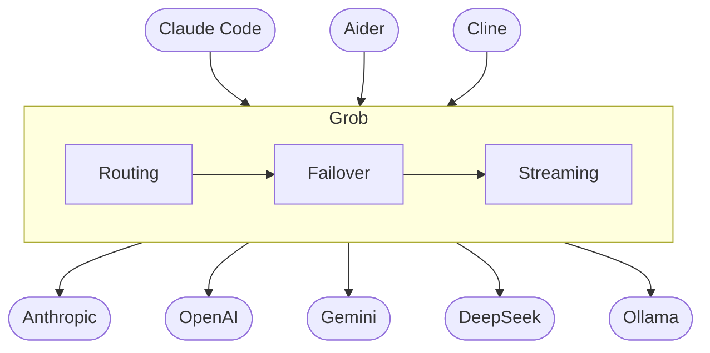
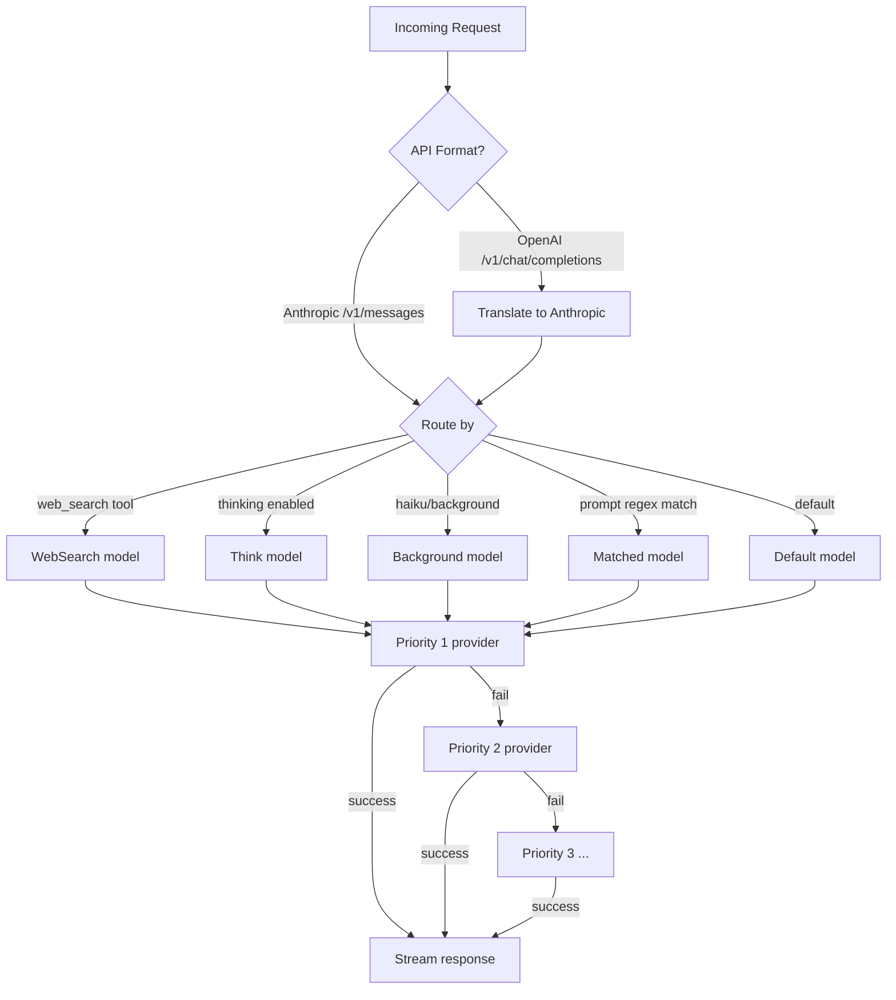

# Grob

> High-performance LLM routing proxy with multi-provider failover

[](https://github.com/azerozero/grob)
[](https://github.com/azerozero/grob/actions/workflows/ci.yml)
[](https://www.elastic.co/licensing/elastic-license)
[](https://www.rust-lang.org/)

Grob sits between your AI coding assistant and your LLM providers. It routes requests to the cheapest/fastest provider, falls back automatically when one goes down, and exposes both Anthropic and OpenAI-compatible APIs.



## Features

- **Multi-provider routing** -- route by task type (thinking, web search, background) or regex patterns on prompts
- **Automatic failover** -- priority-based fallback chain per model
- **Streaming** -- full SSE support for both Anthropic (`/v1/messages`) and OpenAI (`/v1/chat/completions`) APIs
- **Tool calling** -- round-trip translation between Anthropic and OpenAI tool formats
- **OAuth 2.0** -- use Claude Pro/Max, ChatGPT Plus/Pro, and Gemini Pro subscriptions as free API providers
- **Web admin UI** -- configure providers, models, and routing from the browser
- **~6 MB RAM** -- Rust, no runtime overhead

## How routing works



## Install

```bash
# One-liner (Linux/macOS)
curl -fsSL https://raw.githubusercontent.com/azerozero/grob/main/scripts/install.sh | sh

# Via cargo-binstall (pre-built binary)
cargo binstall grob

# From source
cargo install --git https://github.com/azerozero/grob
```

## Quick start

```bash
# Start the server (opens admin UI at http://127.0.0.1:3456)
grob start

# Point your AI tool at Grob
export ANTHROPIC_BASE_URL="http://127.0.0.1:3456"
export ANTHROPIC_API_KEY="any-string"
claude  # or aider, cline, continue, etc.
```

## Configuration

Config lives at `~/.grob/config.toml` (auto-created on first run).

```toml
[server]
port = 3456

# Provider
[[providers]]
name = "anthropic"
provider_type = "anthropic"
api_key = "sk-ant-..."

# Model with fallback
[[models]]
name = "default"

[[models.mappings]]
provider = "anthropic"
actual_model = "claude-sonnet-4-5"
priority = 1

[[models.mappings]]
provider = "openrouter"
actual_model = "anthropic/claude-sonnet-4-5"
priority = 2

# Routing
[router]
default_model = "default"
think_model = "opus"
background_model = "haiku"
```

Or configure everything from the admin UI at `http://127.0.0.1:3456`.

## Presets

```bash
grob preset list              # Show available presets
grob preset apply perf        # Apply performance preset
grob preset apply cheap       # Apply budget preset
grob preset install https://example.com/my-preset.toml
```

## Supported providers

**Anthropic-native**: Anthropic, ZenMux, z.ai, Minimax, Kimi
**OpenAI-compatible**: OpenAI, OpenRouter, Groq, Together, Fireworks, Deepinfra, Cerebras, Nebius, NovitaAI, Baseten
**Google**: Gemini (OAuth/API Key), Vertex AI (ADC)

## License

[Elastic License v2 (ELv2)](https://www.elastic.co/licensing/elastic-license)

Originally forked from [claude-code-mux](https://github.com/elidickinson/claude-code-mux) (MIT).
