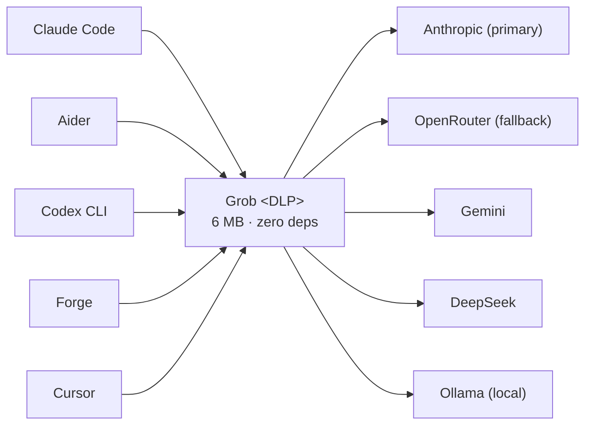
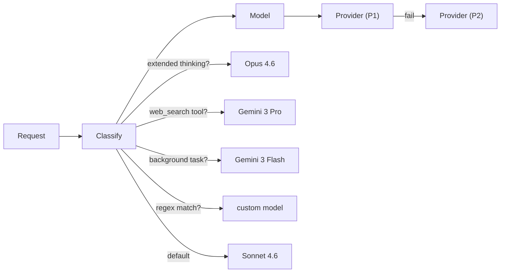

<p align="center">
  <h1 align="center">Grob</h1>
  <p align="center">
    <strong>Your LLM traffic leaks data. Grob stops it.</strong>
  </p>
  <p align="center">
    The only LLM proxy with built-in DLP, written in Rust, deployable air-gapped.
  </p>
  <p align="center">
    <a href="https://github.com/azerozero/grob/actions/workflows/ci.yml"></a>
    <a href="https://github.com/azerozero/grob/releases"></a>
    <a href="LICENSE"></a>
    <a href="https://crates.io/crates/grob"></a>
  </p>
</p>

---

**Grob** is a high-performance LLM routing proxy that sits between your AI tools and your providers. It redacts secrets before they reach the API, fails over transparently when a provider goes down, and fits in a 6 MB container with zero dependencies.

> **~100 µs pure overhead** with full DLP + routing + caching + rate limiting — [50x faster than LiteLLM, every feature measured individually](docs/reference/benchmarks.md).


```mermaid
flowchart LR
    CC[Claude Code] --> G
    AI[Aider] --> G
    CX[Codex CLI] --> G
    FO[Forge] --> G
    CU[Cursor] --> G
    G["Grob &lt;DLP&gt;<br/>6 MB · zero deps"] --> A["Anthropic (primary)"]
    G --> OR["OpenRouter (fallback)"]
    G --> GE[Gemini]
    G --> DS[DeepSeek]
    G --> OL["Ollama (local)"]
```

## Why Grob?

| Problem | How Grob solves it |
|---------|-------------------|
| API keys and secrets leak to LLM providers in prompts | **DLP engine** scans every request — redacts, blocks, or warns before the data leaves |
| Provider goes down during a coding session | **Multi-provider failover** with circuit breakers and exponential backoff. Zero client changes. |
| No visibility into what your AI tools send | **`grob watch`** — live TUI showing every request, response, DLP action, and fallback in real time |
| Bill shock from runaway LLM usage | **Spend tracking** with per-tenant budgets, monthly caps, and alerts at 80% |
| AI agent executes destructive tool calls without review | **HIT Gateway** — intercepts every `tool_use` block, enforces per-policy approval rules (auto-approve / require human / deny), supports multisig and quorum |
| Deploying in air-gapped / sovereign environments | **Single binary, 6 MB, zero dependencies** — no Python, no PostgreSQL, no Redis |

## 30-second quickstart

```bash
# Install (pick one)
brew install azerozero/tap/grob          # macOS / Linux
curl -fsSL https://raw.githubusercontent.com/azerozero/grob/main/scripts/install.sh | sh

# Setup (interactive wizard picks providers + auth)
grob setup

# Launch Claude Code through Grob
grob exec -- claude
```

That's it. Grob auto-starts, routes traffic, and stops when your tool exits.

## DLP — secrets never reach the provider

Every request and response passes through the DLP engine before leaving your machine:

```toml
[dlp]
enabled = true
secrets = "redact"       # API keys, tokens, credentials → [REDACTED]
pii = "warn"             # Emails, phone numbers → logged
names = "pseudonymize"   # Real names → consistent pseudonyms
injection = "block"      # Prompt injection attempts → 400
url_exfil = "block"      # Data exfiltration URLs → stripped
canary = true            # Inject canary tokens to detect leaks
```

No other LLM proxy does this. LiteLLM, Bifrost, Portkey, Kong — none have inline DLP on the hot path.

## Live traffic inspector

```bash
grob watch
```

```
┌─ Providers ──────────────────────────────────────────────────────────┐
│  anthropic ●  142ms  99.2%  │  openrouter ●  380ms  97.1%           │
├─ Live ───────────────────────────────────────────────────────────────┤
│  11:24:03  → claude-sonnet-4-6    anthropic   1.2K tok              │
│  11:24:04  ← claude-sonnet-4-6    anthropic   834 tok  1.4s  $0.02 │
│  11:24:05  DLP: 1 secret redacted (AWS key pattern)                 │
│  11:24:09  FALLBACK: anthropic 429 → openrouter                     │
│  11:24:10  ← gemini-3-flash       openrouter  412 tok  0.6s  $0.001│
├─ Alerts ─────────────────────────────────────────────────────────────┤
│  DLP: 3 secrets | 1 PII | 0 injections   Circuit: all OK            │
└──────────────────────────────────────────────────────────────────────┘
```

## Intelligent routing

Requests are classified by intent, then routed to the best model with automatic fallback:


```mermaid
flowchart LR
    R[Request] --> CL[Classify]
    CL --> M[Model] --> P1["Provider (P1)"]
    P1 -->|fail| P2["Provider (P2)"]
    CL -->|extended thinking?| O[Opus 4.6]
    CL -->|web_search tool?| GP[Gemini 3 Pro]
    CL -->|background task?| GF[Gemini 3 Flash]
    CL -->|regex match?| CM[custom model]
    CL -->|default| S[Sonnet 4.6]
```

Presets configure everything in one command:

| Preset | Think | Default | Cost |
|--------|-------|---------|------|
| **perf** | Opus 4.6 (Anthropic) | Sonnet 4.6 (Anthropic) | Max subscription |
| **medium** | Opus 4.6 (Anthropic) | Kimi K2.5 (OpenRouter) | Max sub + ~$0.30/M |
| **cheap** | DeepSeek R1 (OpenRouter) | GLM-5 (z.ai) | ~$0.15/M |
| **local** | Opus 4.6 (Anthropic) | Qwen 2.5 Coder (Ollama) | Max sub + free |

```bash
grob preset apply perf
```

## Supported providers

| Provider | Auth | Notes |
|----------|------|-------|
| **Anthropic** | API key / OAuth (Max) | Claude models |
| **OpenAI** | API key | GPT, o-series |
| **Gemini** | API key / OAuth (Pro) | Google AI Studio |
| **Vertex AI** | ADC | Google Cloud |
| **OpenRouter** | API key | 200+ models |
| **Ollama** | none | Local inference |
| **DeepSeek** | API key | V3, R1 |
| **Mistral** | API key | Devstral, Codestral |
| **Groq** | API key | Fast inference |

Any OpenAI-compatible API works with `provider_type = "openai"` and a custom `base_url`.

## Multi-tenant virtual keys

Distribute API keys to teams with per-key budgets, rate limits, and model restrictions:

```bash
grob key create --name "frontend-team" --tenant frontend --budget 50 --rate-limit 20
# grob_a1b2c3d4e5f6... (shown once, hashed at rest)

grob key list
# PREFIX        NAME            TENANT     BUDGET    RATE
# grob_a1b2...  frontend-team   frontend   $50/mo    20 rps
# grob_f8e7...  ml-pipeline     data       $200/mo   100 rps
```

## Fan-out racing

Send the same request to multiple providers in parallel. Pick the fastest, cheapest, or best-quality response:

```toml
[[models]]
name = "best-answer"
strategy = "fan_out"

[models.fan_out]
mode = "fastest"   # or "best_quality", "weighted"
```

## Regulatory compliance

Grob maps its features to specific regulatory articles. Every claim is [verified against the codebase](docs/reference/features.md#implementation-verification-audited-2026-03-18).

| Regulation | Coverage |
|------------|----------|
| **EU AI Act** | Art. 12 (signed audit log with model/tokens), Art. 14 (risk scoring + escalation webhook), Art. 15 (injection detection, 28 languages), Art. 52 (transparency headers) |
| **GDPR/RGPD** | PII redaction, name pseudonymization, EU-only provider routing (`gdpr = true`), canary tokens for leak detection |
| **HDS/PCI DSS/SecNumCloud** | Hash-chained audit entries, Merkle batch signing, classification NC/C1/C2/C3, AES-256-GCM credentials at rest |
| **NIS2/DORA** | Multi-provider resilience, escalation webhooks, zero-downtime upgrades |

```bash
grob preset apply eu-ai-act   # EU AI Act + GDPR in one command
grob preset apply gdpr        # EU-only routing + DLP
```

## Also included

- **Signed audit log** — ECDSA-P256 / Ed25519 / HMAC-SHA256, hash-chained, Merkle tree batch signing
- **Response caching** — Dedup temperature=0 requests (saves tokens and money)
- **Native TLS + ACME** — Built-in HTTPS with Let's Encrypt auto-certificates
- **Three API endpoints** — `/v1/messages` (Anthropic), `/v1/chat/completions` (OpenAI), `/v1/responses` (Codex CLI)
- **Prometheus + OpenTelemetry** — `/metrics` endpoint, OTLP distributed tracing

See the [full feature matrix](docs/reference/features.md) for rate limiting, JWT/OAuth, log export, zero-downtime upgrades, record & replay, and more.

## Configuration

```toml
[[providers]]
name = "anthropic"
provider_type = "anthropic"
auth_type = "oauth"
oauth_provider = "anthropic-max"

[[providers]]
name = "openrouter"
provider_type = "openrouter"
api_key = "$OPENROUTER_API_KEY"

[[models]]
name = "default"
[[models.mappings]]
provider = "anthropic"
actual_model = "claude-sonnet-4-6"
priority = 1
[[models.mappings]]
provider = "openrouter"
actual_model = "openai/gpt-5.4"
priority = 2

[router]
default = "default"
think = "claude-opus-thinking"

[server]
port = 13456
```

See [Configuration Reference](docs/CONFIGURATION.md) for all options.

## CLI

```
grob setup                Start the interactive setup wizard
grob start [-d]           Start the server (--detach for background)
grob stop / restart       Stop or restart the server
grob exec -- <cmd>        Run a command behind the proxy (auto start/stop)
grob watch                Live traffic inspector (TUI dashboard)
grob status               Service status + spend summary
grob spend                Monthly spend breakdown
grob key create/list/revoke  Manage virtual API keys
grob validate             Test all providers with real API calls
grob doctor               Run diagnostic checks
grob preset list/apply    Manage presets
grob connect [provider]   Set up credentials interactively
```

## Container

```bash
docker run -e ANTHROPIC_API_KEY=sk-... ghcr.io/azerozero/grob:latest
```

6 MB image, `FROM scratch`, TLS bundled via rustls. No OS layer needed.

## Documentation

| Doc | Description |
|-----|-------------|
| [Feature Matrix](docs/reference/features.md) | Complete feature list with config references |
| [Getting Started](docs/tutorials/getting-started.md) | Step-by-step tutorial |
| [Configuration Reference](docs/CONFIGURATION.md) | All config options |
| [DLP Reference](docs/reference/dlp.md) | Secret scanning, PII, injection, URL exfil |
| [DLP How-To](docs/how-to/dlp.md) | Recipes for each DLP feature |
| [Security Model](docs/explanation/security.md) | Rate limiting, audit, circuit breakers |
| [Architecture](docs/ARCHITECTURE.md) | Module layout and design decisions |
| [CLI Reference](docs/reference/cli.md) | Full command documentation |
| [OAuth Setup](docs/OAUTH_SETUP.md) | Anthropic Max, Gemini Pro |
| [Benchmarks](docs/reference/benchmarks.md) | AWS results, competitor comparison |
| [Provider Setup](docs/PROVIDERS.md) | Per-provider guides |

## Contributing

See [CONTRIBUTING.md](CONTRIBUTING.md) for development setup, testing, and PR guidelines.

## License

[AGPL-3.0](LICENSE) — Commercial licensing available. See [LICENSING.md](LICENSING.md).

Built in Rust. Copyright (c) 2025-2026 [A00 SASU](https://github.com/azerozero).
