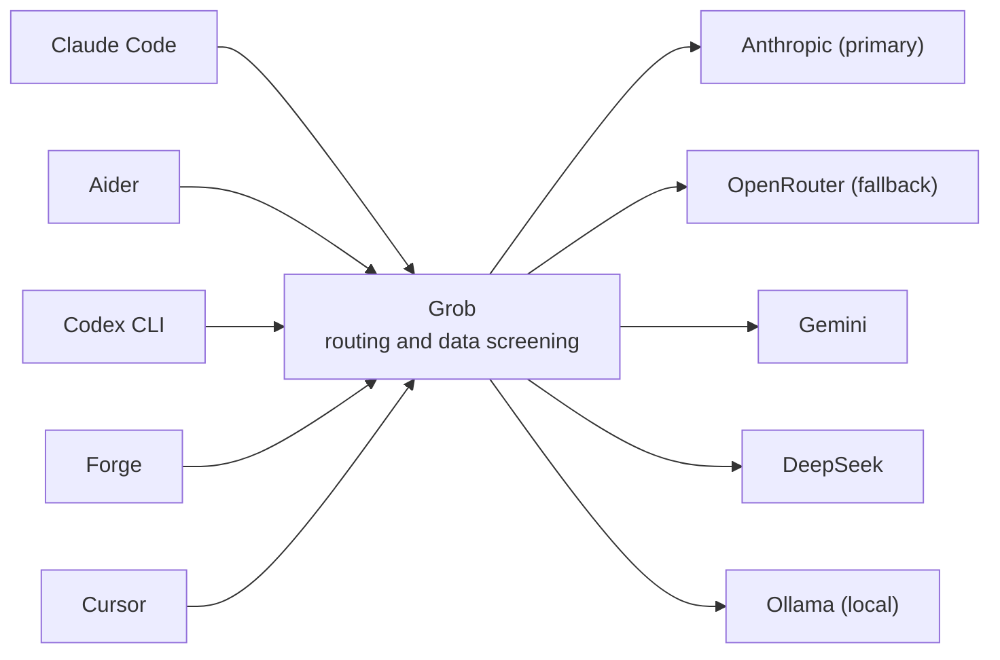
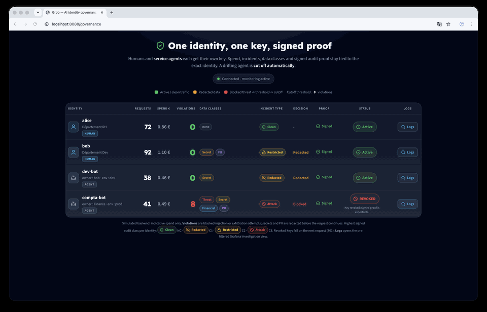
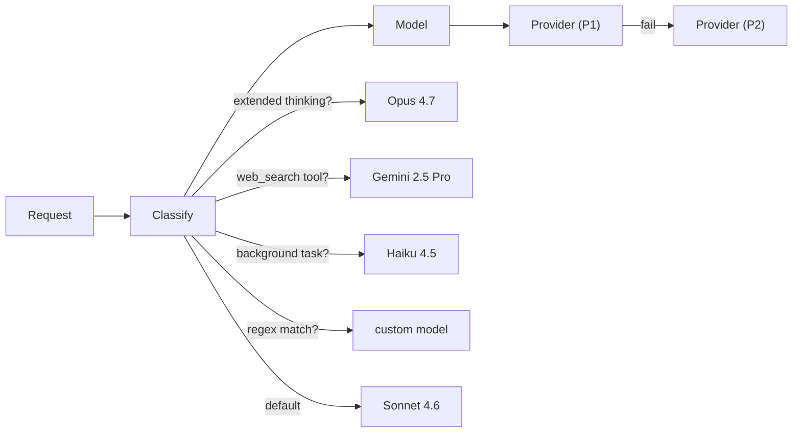

<p align="center">
  <h1 align="center">Grob</h1>
  <p align="center">
    <strong>Don't give your coding agents a blank check &mdash; on spend or on secrets.</strong>
  </p>
  <p align="center">
    Route AI requests, screen sensitive data, and track spending through one proxy.
  </p>
  <p align="center">
    <a href="https://github.com/azerozero/grob/actions/workflows/ci.yml"></a>
    <a href="https://github.com/azerozero/grob/releases"></a>
    <a href="https://github.com/azerozero/grob/releases"></a>
    <a href="LICENSE"></a>
  </p>
</p>

---

**Grob** sits between your AI tools and model providers. Configure it to screen
requests for secrets, switch providers after a failure, enforce budgets, and
record signed audit logs. It runs as a standalone Rust binary or container.

[Start here](docs/tutorials/getting-started.md) for your first run, or use the
[documentation index](docs/index.md) to find a guide by task. For measured
performance and its test conditions, see [benchmarks](docs/reference/benchmarks.md).


```mermaid
flowchart LR
    CC[Claude Code] --> G
    AI[Aider] --> G
    CX[Codex CLI] --> G
    FO[Forge] --> G
    CU[Cursor] --> G
    G["Grob<br/>routing and data screening"] --> A["Anthropic (primary)"]
    G --> OR["OpenRouter (fallback)"]
    G --> GE[Gemini]
    G --> DS[DeepSeek]
    G --> OL["Ollama (local)"]
```

## Why Grob?

| Problem | How Grob solves it |
|---------|-------------------|
| API keys and secrets leak to LLM providers in prompts | **Data Loss Prevention (DLP)** scans configured traffic and can redact or block detected content |
| Provider goes down during a coding session | **Multi-provider failover** with circuit breakers and exponential backoff. Zero client changes |
| No visibility into what your AI tools send | **`grob watch`** -- live TUI showing every request, response, DLP action, and fallback in real time |
| Bill shock from runaway LLM usage | **Spend tracking** with per-tenant budgets, monthly caps, and alerts at 80% |
| Agent context grows until providers return opaque 5xx errors | **Context-window guard** estimates input tokens before dispatch, returns `context_length_exceeded`, and tells Codex/Claude to compact |
| AI agent executes destructive tool calls without review | **HIT Gateway** -- intercepts every `tool_use` block, enforces per-policy approval rules (auto-approve / require human / deny), supports multisig and quorum |
| Deploying with local or approved providers | **Standalone binary or scratch container**; no separate database or Python runtime required |

## Quickstart

Install your coding tool separately. The example below uses Claude Code (`claude`
on your `PATH`) and a configured provider account. For an API key, OAuth login or
Windows setup, follow the [getting-started tutorial](docs/tutorials/getting-started.md).

**With Homebrew** (macOS / Linux):
```bash
brew install azerozero/tap/grob
```

**Without Homebrew** (Linux / CI):
```bash
curl -fsSL https://raw.githubusercontent.com/azerozero/grob/main/scripts/install.sh | sh
```

Then:
```bash
grob setup        # writes ~/.grob/config.toml (override with GROB_CONFIG or --config)
grob exec -- claude
```

Grob starts the proxy if needed and launches your tool. Check it from another
terminal with `grob status`. A proxy started by `grob exec` stops when the tool
exits; an already running proxy stays running. For IPv4-only systems, configure
the listener as described in the tutorial.

## Local demo -- DLP, signed audit, and Grafana

Want to see the full protection story without spending real provider tokens?
Run the reproducible local demo:

<p align="center">
  
</p>

```bash
cd deploy/demo
make demo
```

It starts a simulated backend, live DLP traffic, the governance console, Loki,
Tempo, and Grafana. Open:

- **Governance console**: <http://localhost:8088/governance>
- **Live DLP feed**: <http://localhost:8088>
- **Grafana dashboards**: <http://localhost:3000> (`admin` / `admin`)

The demo shows clean traffic, redacted secrets/PII, blocked prompt injection and
exfiltration attempts, signed audit evidence, and per-identity cutoff for a
drifting service agent. The walkthrough is in
[`docs/demos/showcase-rssi/DEMO.md`](docs/demos/showcase-rssi/DEMO.md); the
pre-flight checklist is in
[`docs/demos/showcase-rssi/PREFLIGHT.md`](docs/demos/showcase-rssi/PREFLIGHT.md).

## DLP -- secrets screened before they reach the provider

Enable screening in your Grob configuration:

```toml
[dlp]
enabled = true

[[dlp.secrets]]
name = "custom_token"
prefix = "tok_"
pattern = "tok_[A-Za-z0-9]{40}"
action = "redact"            # API keys, tokens, credentials → [REDACTED]

```

This example adds a custom token rule to the built-in secret rules. See
[DLP recipes](docs/how-to/dlp.md) for financial identifiers, configured names,
prompt injection and URL filtering. Detection has limits; it cannot guarantee
that every sensitive value is removed.

## Live traffic inspector

```bash
grob watch
```

The terminal view shows traffic, provider state and DLP events from a running
instance. See [observability](docs/reference/observability.md) for access,
metrics and trace configuration.

## Intelligent routing

Configured rules choose a logical model, then try its provider mappings.
This diagram illustrates a possible setup; Grob does not measure which model is
best for every request:


```mermaid
flowchart LR
    R[Request] --> CL[Classify]
    CL --> M[Model] --> P1["Provider (P1)"]
    P1 -->|fail| P2["Provider (P2)"]
    CL -->|extended thinking?| O[Opus 4.7]
    CL -->|web_search tool?| GP[Gemini 2.5 Pro]
    CL -->|background task?| GF[Haiku 4.5]
    CL -->|regex match?| CM[custom model]
    CL -->|default| S[Sonnet 4.6]
```

Presets provide starting configurations. Inspect their providers and required
credentials before applying them; names do not guarantee cost or compliance.

```bash
grob preset list
grob preset info perf   # inspect before applying
grob preset apply perf
```

See [preset operations](docs/reference/operations.md#presets) for the available
profiles. The [optional model supervisor](docs/decisions/0033-advisory-model-supervisor.md)
is a proposal for future routing improvement, not a current runtime option.

## Supported providers

| Provider | Auth | Notes |
|----------|------|-------|
| **Anthropic** | API key / OAuth (Max) | Claude models |
| **OpenAI** | API key | GPT, o-series |
| **Gemini** | API key / OAuth (Pro) | Google AI Studio |
| **Vertex AI** | ADC | Google Cloud |
| **OpenRouter** | API key | 200+ models |
| **DeepSeek** | API key | DeepSeek V4, R1 |
| **Mistral** | API key | Devstral, Codestral |
| **Groq** | API key | Fast inference |
| **z.ai** | API key | GLM-4 family |
| **MiniMax** | API key | MiniMax models |
| **Kimi Coding** | API key | Kimi K2 |
| **Zenmux** | API key | Aggregated routing |
| **Ollama** | none | Local inference |

Any OpenAI-compatible API works with `provider_type = "openai"` and a custom `base_url`.

## Multi-tenant virtual keys

Distribute API keys to teams with per-key budgets, rate limits, and model restrictions:

```bash
grob key create --name "frontend-team" --tenant frontend --budget 50 --rate-limit 20
# grob_a1b2c3d4e5f6... (shown once, hashed at rest)

grob key list
# PREFIX        NAME            TENANT     BUDGET    RATE
# grob_a1b2...  frontend-team   frontend   $50/mo    20 rps
# grob_f8e7...  ml-pipeline     data       $200/mo   100 rps
```

## Fan-out racing

Send the same request to multiple providers in parallel. Select the fastest
successful response, use a quality judge, or rank by output-token count and latency.
The weighted mode does not select the cheapest response. See the
[fan-out limits](docs/reference/fan-out.md#cost-tracking) before using it with budgets.

```toml
[[models]]
name = "best-answer"
strategy = "fan_out"

[models.fan_out]
mode = "fastest"   # or "best_quality", "weighted"
```

## Compliance controls

Grob maps technical controls to regulatory evidence needs. It does not certify
your organization by itself; operators still need legal review, provider due
diligence, and a hardened configuration. See the
[feature matrix and limits](docs/reference/features.md#regulatory-compliance).

| Regulation | Coverage |
|------------|----------|
| **EU AI Act** | Signed audit records, request risk signals, escalation webhooks and provider/model headers |
| **GDPR/RGPD** | Configured PII redaction, name pseudonymization, region filtering with a `global` exception, canary tokens for leak detection |
| **HDS/PCI-style evidence** | Hash-chained audit entries, Merkle batch signing, classification NC/C1/C2/C3, AES-256-GCM credentials at rest |
| **NIS2/DORA** | Multi-provider resilience, escalation webhooks, zero-downtime upgrades, SBOM on every release. [Reporting duties stay with you](docs/reference/features.md#nis2--dora) |

```bash
grob preset apply eu-ai-act   # EU AI Act + GDPR-oriented controls
grob preset apply gdpr        # EU-only routing + DLP
```

## Also included

- **Signed audit log** -- ECDSA-P256 / Ed25519 / HMAC-SHA256, hash-chained, Merkle tree batch signing
- **Response caching** -- Dedup temperature=0 requests (saves tokens and money)
- **Native TLS + ACME** -- Built-in HTTPS with Let's Encrypt auto-certificates
- **Three API endpoints** -- `/v1/messages` (Anthropic), `/v1/chat/completions` (OpenAI), `/v1/responses` (Codex CLI)
- **Context-window guard** -- pre-dispatch compact hints and OpenAI/Anthropic-compatible `context_length_exceeded` errors
- **Prometheus + OpenTelemetry** -- `/metrics` endpoint, OTLP distributed tracing
- **MCP tool matrix** -- JSON-RPC server for tool-calling orchestration

See the [full feature matrix](docs/reference/features.md) for rate limiting, JWT/OAuth, log export, zero-downtime upgrades, record & replay, and more.

## Known limitations

Grob is honest about what it is:

- **DLP is a guardrail, not a cryptographic boundary.** It redacts secrets/PII and blocks common prompt-injection and exfiltration patterns before egress. A determined attempt can still get through &mdash; pair it with isolation, code review, and least-privilege secrets handling.
- **Spend caps are enforced per upstream call, not token-by-token.** A multi-request agent run is stopped before the next call once over budget; a single in-flight streamed response can still overrun its own cost.
- **Compliance controls are not certification.** Grob maps technical controls to audit-evidence needs; it does not make your organization compliant by itself. Legal review and provider due diligence are still on you.
- **Young project, small team.** The core is public, Apache-2.0, and actively developed &mdash; but this is early software. Pilot it before betting production on it, and open an issue when something breaks.

## Configuration

```toml
[[providers]]
name = "anthropic"
provider_type = "anthropic"
models = []
auth_type = "oauth"
oauth_provider = "anthropic-max"

[[providers]]
name = "openrouter"
provider_type = "openrouter"
models = []
api_key = "$OPENROUTER_API_KEY"

[[models]]
name = "default"
context_window_tokens = 200000
[[models.mappings]]
provider = "anthropic"
actual_model = "claude-sonnet-4-6"
priority = 1
[[models.mappings]]
provider = "openrouter"
actual_model = "openai/gpt-5"
priority = 2

[router]
default = "default"

[server]
port = 13456
```

See [Configuration Reference](docs/reference/configuration.md) for all options.

## CLI

```
grob setup                Start the interactive setup wizard
grob start [-d]           Start the server (--detach for background)
grob stop / restart       Stop or restart the server
grob exec -- <cmd>        Run a command behind the proxy (auto start/stop)
grob watch                Live traffic inspector (TUI dashboard)
grob status               Service status + spend summary
grob spend                Monthly spend breakdown
grob key create/list/revoke  Manage virtual API keys
grob secrets add/list/test    Manage encrypted upstream secrets
grob validate             Test all providers with real API calls
grob doctor               Run diagnostic checks
grob preset list/apply    Manage presets
grob connect [provider]   Set up credentials interactively
```

## Container

The image listens on container port `8080` and supports the same config path contract as the binary:

```bash
docker volume create grob-data
docker run --rm -p 127.0.0.1:8080:8080 \
  -v "$HOME/.grob/config.toml:/etc/grob/config.toml:ro" \
  -v grob-data:/var/lib/grob \
  -e GROB_CONFIG=/etc/grob/config.toml \
  -e GROB_HOME=/var/lib/grob \
  ghcr.io/azerozero/grob:latest
```

Use `-p 127.0.0.1:13456:8080` to expose the native host port on loopback. Supply
the credentials required by your mounted configuration; OAuth tokens on the host
are not automatically copied into the container volume. See the
[deployment guide](docs/how-to/deploy.md) for credential setup, shared access and
persistent storage. Image size depends on the target and release.

## Project structure

```
src/
├── server/              Axum HTTP server and dispatch pipeline
│   ├── dispatch/        Core dispatch: DLP, cache, route, provider loop
│   ├── openai_compat/   OpenAI /v1/chat/completions translation
│   ├── responses_compat/  OpenAI Responses API translation
│   ├── rpc/             JSON-RPC control plane
│   ├── watch_sse.rs     Live traffic inspector SSE backend
│   └── fan_out.rs       Parallel multi-provider dispatch
├── providers/           Provider implementations and registry
├── routing/             Request routing: classification + nature-inspired primitives
│   ├── classify/        Regex-based request classification engine (task type, tier, auto-map)
│   ├── circuit_breaker.rs  Passive per-endpoint circuit breaker (RE-1a, ADR-0018)
│   └── health_check.rs     Active per-provider health probe (RE-1b, opt-in)
├── cli/                 Config structs and CLI argument parsing
├── commands/            CLI command implementations
├── auth/                OAuth client, token store, JWT validation
├── features/
│   ├── dlp/             Secret scanning, PII, canary tokens
│   ├── policies/        HIT Gateway, per-action authorization
│   ├── token_pricing/   Pricing, spend tracking, budgets
│   ├── mcp/             MCP tool matrix, JSON-RPC server
│   ├── tap/             Webhook event emission
│   ├── harness/         Record & replay sandwich testing
│   ├── tool_layer/      Tool-calling abstraction layer
│   ├── pledge/          Pledge-based capability restrictions
│   ├── watch/           TUI dashboard and live traffic inspector support
│   └── log_export/      Encrypted audit log export
├── shared/              Cross-cutting modules (not tied to a single slice)
│   ├── acme.rs          Automatic TLS certificate provisioning via ACME
│   ├── instance.rs      Multi-instance coordination (PID + port probing)
│   ├── net.rs           Network binding with SO_REUSEPORT
│   ├── otel.rs          OpenTelemetry subscriber bootstrap
│   ├── pid.rs           PID file management for daemon mode
│   └── message_tracing/ Request/response trace pipeline (JSONL + rotation)
├── security/            Circuit breakers, rate limiting, audit log
├── storage/             Persistent storage layer: atomic files, JSONL journals (GrobStore)
├── models/              Model and message type definitions
├── cache/               Response cache layer
├── pricing.rs           Static model pricing (leaf module, breaks cycle providers↔features)
└── preset/              Preset management system
```

## Development

### Prerequisites

- Rust stable (edition 2021)
- For TUI features: a terminal with 256-color support
- [prek](https://github.com/j178/prek) for pre-commit hooks (optional but recommended)

### Build and run

```bash
cargo build
cargo run -- start
```

### Tests

```bash
cargo test
```

### Pre-commit hooks

```bash
prek install   # activates fmt, clippy, gitleaks on commit
```

### Benchmarks

```bash
cargo bench --bench routing
cargo bench --bench hotpath
```

## Documentation

The [documentation index](docs/index.md) covers setup, operation, security,
credential replacement, troubleshooting and design proposals.

| Doc | Description |
|-----|-------------|
| [Feature Matrix](docs/reference/features.md) | Capability overview with configuration links and limits |
| [Getting Started](docs/tutorials/getting-started.md) | Step-by-step tutorial |
| [Configuration Reference](docs/reference/configuration.md) | Configuration options, defaults and advanced-guide gaps |
| [DLP Reference](docs/reference/dlp.md) | Secret scanning, PII, injection, URL exfil |
| [DLP How-To](docs/how-to/dlp.md) | Recipes for each DLP feature |
| [Security Model](docs/explanation/security.md) | Rate limiting, audit, circuit breakers |
| [Architecture](docs/explanation/architecture.md) | Module layout and design decisions |
| [CLI Reference](docs/reference/cli.md) | Full command documentation |
| [OAuth Setup](docs/how-to/oauth-setup.md) | Anthropic Max, Gemini Pro |
| [Benchmarks](docs/reference/benchmarks.md) | AWS results, competitor comparison |
| [Provider Setup](docs/how-to/providers.md) | Per-provider guides |
| [Python SDK Examples](docs/examples/sdk-python.md) | Call Grob from `anthropic` and `openai` Python SDKs |
| [Node SDK Examples](docs/examples/sdk-node.md) | Call Grob from `@anthropic-ai/sdk` and `openai` Node SDKs |

## Contributing

See [CONTRIBUTING.md](CONTRIBUTING.md) for development setup, testing, and PR guidelines.

## License

[Apache-2.0](LICENSE). Commercial Admin, Enterprise, Cloud, and support products
are described in [LICENSING.md](LICENSING.md).

Built in Rust. Copyright (c) 2025-2026 [A00 SASU](https://github.com/azerozero).
