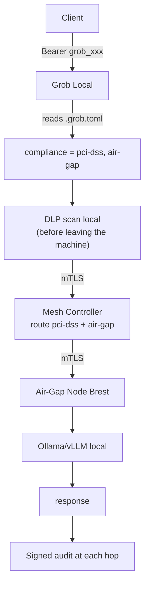
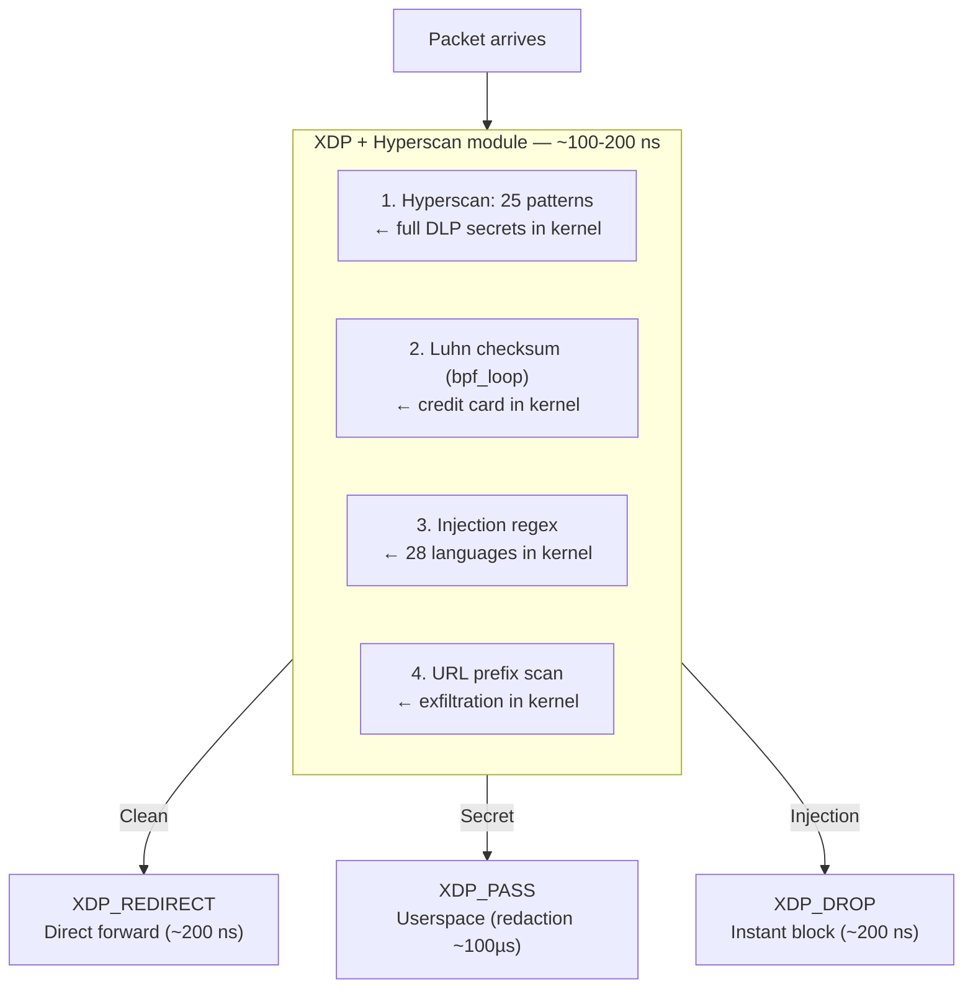

# Grob Roadmap — Priorities by business impact

**Last updated**: 2026-03-21

---

## Tier 1 — Ship (weeks 1-2) ✅

| # | Feature | Status |
|---|---------|--------|
| 1 | Published benchmarks (overhead, RPS, escalation, payload sizes) | ✅ |
| 2 | README "Obviously Awesome" | ✅ |

## Tier 2 — Visible differentiation (weeks 3-6) ✅

| # | Feature | Status |
|---|---------|--------|
| 3 | `grob watch` (live TUI dashboard) | ✅ |
| 4 | OpenTelemetry (OTLP export) | ✅ |

## Tier 3 — Scale & monetization (months 2-4) ✅

| # | Feature | Status |
|---|---------|--------|
| 5 | Virtual keys multi-tenant (budget, rate limit, model allowlist) | ✅ |
| 6 | Log export (stdout, file, HTTP) | ✅ |
| 7 | Multi-account key pool (sequential, round_robin, fallback) | ✅ |
| 8 | Config promotion pipeline (push, pull, rollback) | ✅ |
| 9 | `grob bench` CLI (escalation, concurrency, 5 payload sizes) | ✅ |

---

## Tier 4 — Sovereign Proxy Mesh (M6-M12)

Multi-node architecture with compliance-based routing, eBPF XDP, and signed announcements.

### Target pricing

| Tier | Price | Includes |
|------|-------|----------|
| **Community** | Free (AGPL) | Single node, all current features |
| **Pro** | €500-800/mo | Virtual keys, log export, 48h SLA support |
| **Enterprise** | €2,000-5,000/mo | Multi-node mesh, signed announcements, cross-node audit |
| **Sovereign** | €20-50k/yr + consulting | Air-gapped, eBPF XDP, LoRA adapters, custom PKI |

### Phase 4.1 — Passthrough mode (2-3d)

Byte-level proxy without JSON parsing when no L7 feature is enabled.

| Metric | Current (L7) | Passthrough | Bifrost |
|--------|:---:|:---:|:---:|
| Overhead | ~100µs | **~5µs** | 11µs |
| Technique | hyper zero-copy, no serde | io::copy blob | Go net/http |

### Phase 4.2 — Mesh discovery + signed announcements (5-7d)

Each node broadcasts its compliance capabilities, cryptographically signed.

| Feature | Description |
|---------|-------------|
| **Signed announcements** | ECDSA P-256 signed JSON: `node_id`, `capabilities` (GDPR, PCI, HIPAA, air-gap), `region`, `load`, `timestamp` |
| **Signer** | Human (CISO certifies PCI compliance), HSM (auto-rotation), or CI pipeline (post-audit) |
| **Verification** | Nodes verify signature before accepting routing |
| **Lifecycle** | Re-announce every 5 min, expires after 15 min without refresh |
| **Anti-tampering** | Node removed from mesh if signature is invalid or expired |

```toml
[mesh.announce]
signing_key = "/etc/grob/mesh-signing.key"  # ECDSA P-256
interval = "5m"
expires_after = "15m"
# Who signs: "human" | "hsm" | "ci-pipeline"
signer_type = "human"
```

```json
{
  "node_id": "eu-paris-01",
  "capabilities": ["gdpr", "pci-dss", "eu-ai-act"],
  "region": "eu-west-3",
  "providers": ["mistral", "ovh-ai"],
  "load": 0.3,
  "timestamp": "2026-03-21T10:00:00Z",
  "signer": "ciso@company.com",
  "signature": "MEUCIQD..."
}
```

### Phase 4.3 — Mesh controller + compliance routing (5-7d)

| Feature | Description |
|---------|-------------|
| **Controller** | Receives announcements, maintains compliance-based routing table |
| **Constraint-based routing** | Client requests "GDPR + PCI" → routes to EU Paris node |
| **Geo-routing** | Latency-aware + data residency (region tag) |
| **Mesh failover** | If EU-1 node down → circuit breaker → failover to EU-2 node |
| **mTLS inter-node** | All hops encrypted with mutual client certificates |
| **Load balancing** | Weighted by `load` in announcements (least-loaded first) |



### Phase 4.4 — eBPF XDP + Hyperscan DLP (5-10d)

Hybrid kernel/userspace architecture with **full DLP in kernel** via Hyperscan.

**Reference**: [Gcore](https://gcore.com/blog/how-we-use-regular-expressions-in-xdp-for-packet-filtering) runs regex in XDP in production at 200M pps by compiling Hyperscan as a kernel module. Linux 6.x+ supports `bpf_loop` (8M iterations) and open-coded iterators (v6.4+).

#### Kernel DLP — what is now possible

| DLP validation | XDP+Hyperscan | How | Latency |
|----------------|:---:|---------|:---:|
| Secret scan (25 patterns) | ✅ | Hyperscan kernel module (Aho-Corasick) | ~100 ns |
| PII credit card (Luhn) | ✅ | `bpf_loop` arithmetic | ~50 ns |
| PII IBAN (mod97) | ✅ | `bpf_loop` arithmetic | ~50 ns |
| Prompt injection (28 languages) | ✅ | Hyperscan kernel module | ~100 ns |
| URL exfiltration | ✅ | Prefix "https://" + domain scan (no full URL parse needed) | ~50 ns |
| Name pseudonymization | ❌ | HMAC + state → userspace | ~1µs |
| JSON parsing | ❌ | Not needed: DLP scans raw bytes, not JSON fields | — |
| Inter-node routing | ✅ | L3/L4 packet forwarding | ~200 ns |
| mTLS termination | ❌ | Userspace (kTLS for data path) | ~50µs |

#### Architecture



#### Performance

| Scenario | Without XDP | With XDP+Hyperscan | Gain |
|----------|:---:|:---:|:---:|
| Clean traffic (99%) | ~170µs | **~100-200 ns** | **1000x** |
| Secret detected (block) | ~400µs | **~200 ns** (XDP_DROP) | **2000x** |
| Secret detected (redaction) | ~400µs | ~400µs (userspace) | 0 |
| Injection (block) | ~400µs | **~200 ns** (XDP_DROP) | **2000x** |
| Inter-node forward | ~50µs | **~200 ns** | **250x** |

#### Single-node impact (no mesh)

XDP also improves the current proxy by offloading DLP to the kernel:

| Metric | Without XDP | With XDP inline |
|--------|:---:|:---:|
| Grob CPU for DLP | ~40% of time | **~0%** (offloaded to kernel) |
| Throughput RPS | 40K | **~60-80K** (cores freed) |
| Injection/DDoS block | ~400µs (userspace) | **~200ns** (XDP_DROP, grob sees nothing) |
| Clean traffic latency | ~170µs | ~170µs (unchanged) |

**Note**: DLP does not need JSON parsing — Aho-Corasick scans the raw bytes of the HTTP body. Routing (extracting the `model` field) remains in userspace.

#### Sub-phases

| # | Component | Effort |
|---|-----------|--------|
| 4.4a | Hyperscan kernel module + eBPF helpers | 5-7d |
| 4.4b | XDP DLP program (`aya-rs`) | 3-5d |
| 4.4c | Luhn/mod97 in `bpf_loop` | 1-2d |
| 4.4d | Grob integration (XDP_PASS → userspace) | 2-3d |

**Crates**: `aya` (Rust eBPF), Hyperscan (Intel, kernel module).

#### Physical limits

| Technique | Floor | Usage |
|-----------|:---:|---|
| HTTP TCP | ~3-5 µs | Current standard |
| eBPF XDP | ~100 ns | Kernel forwarding + DLP |
| DPDK | ~50 ns | Full kernel bypass (dedicated CPU) |
| Shared memory | ~10 ns | Intra-machine |
| L1 cache | ~1 ns | Intra-process |
| Sub-ns | Impossible | Physical limit (light = 30cm/ns) |

### Phase 4.5 — Cross-node audit (3-5d)

| Feature | Description |
|---------|-------------|
| **Shared Merkle chain** | Each hop adds a signed entry to the audit chain |
| **Cross-node traceability** | Full audit trail: client → local → mesh → node → provider |
| **End-to-end verification** | An auditor can verify the complete chain with each node's public keys |
| **Non-repudiation** | Each node signs its entry — impossible to deny processing |

### Total Tier 4 effort

| Phase | Component | Effort |
|-------|-----------|--------|
| 4.1 | Passthrough mode | 2-3d |
| 4.2 | Mesh discovery + signed announcements | 5-7d |
| 4.3 | Mesh controller + compliance routing | 5-7d |
| 4.4 | eBPF XDP | 3-5d |
| 4.5 | Cross-node audit | 3-5d |
| **Total** | | **~3-4 weeks** |

---

## Zero Trust — Inter-component security

### Level 1 — Implemented ✅

| Feature | Status |
|---------|--------|
| JWT auth on incoming requests | ✅ RS256/HS256, JWKS refresh |
| Virtual keys auth | ✅ SHA-256 hash, per-key budget/rate-limit |
| Per-token rate limiting | ✅ Per-tenant token bucket |
| Constant-time auth | ✅ `subtle` crate |
| mTLS client cert upstream | ✅ `tls_cert`/`tls_key`/`tls_ca` per provider |
| DLP key rotation | ✅ Auto every 24h (configurable) |

### Level 2 — Feature requests (backlog)

| Feature | Description | Priority |
|---------|-------------|----------|
| **LoRA adapter registry** | Secure LoRA distribution via OCI registry with ECDSA signature + SHA-256 manifest + JWT license token | M6+ |
| **LoRA dynamic loading** | Header `X-Dunst-Adapter` + JWT verification → loads adapter if cached, pulls if absent | M6+ |
| **LoRA local file (air-gap)** | `.gguf` + `.gguf.sig` + `manifest.toml` with SHA-256 + ECDSA signature. Refuses to start if signature is invalid. | M6+ |
| **HSM for session keys** | Full PKI with HSM for DLP session keys. Overkill except for NATO contracts. | On client request |
| **Per-request LLM re-auth** | Verify identity at each generated token. Overkill for 99% of use cases. | On client request |
| **SSE stream integrity** | Signature on each SSE chunk. Overkill. | On client request |

---

## Clean code — Technical debt ✅

**Score**: 7.4/10 → fixed (handler boilerplate, scorer consolidation, router tests, crypto unwrap, error-path tests).

---

## Documentation ✅

**DCI Score**: 9.5/10. 16 reference docs, AGENTS.md, llms.txt, feature matrix with compliance verification.

---

## Benchmarks — Published numbers ✅

### Per-feature overhead (80KB payload, macOS 16 cores)

| Scenario | P50 | Pure overhead |
|----------|:---:|:---:|
| TCP baseline (direct) | 123µs | — |
| Proxy only | 290µs | +167µs |
| + DLP (clean text) | 556µs | +433µs |
| + DLP (trigger) | 533µs | +410µs |
| + All features | 537µs | +414µs |

### Concurrent throughput (c=16)

| Scenario | RPS |
|----------|:---:|
| Direct baseline | 82,500 |
| Proxy + all features | 40,100 |

### Signing cost

| Algorithm | Latency |
|-----------|:---:|
| HMAC-SHA256 | 1.2µs |
| Ed25519 | 19µs |
| ECDSA P-256 | 152µs |

### Competitor comparison

| Proxy | Overhead | RPS | Active features |
|-------|:---:|:---:|---|
| **Grob** | **~100µs** | **40K** | DLP + routing + cache + rate limit |
| Bifrost | 11µs | 5K | Proxy only (byte-copy) |
| TensorZero | 370µs | 10K | Proxy only |
| LiteLLM | ~5000µs | 200 | Proxy only |

---

## Not prioritized (backlog)

| Feature | Why not now |
|---------|------------|
| SSO/OIDC | First clients are air-gapped — no Okta |
| RBAC | Need virtual keys first |
| Embeddings/images/audio | Market = coding assistants, not DALL-E |
| A2A protocol | Too early, near-zero adoption |
| SOC2/ISO | 0 paying clients, $30-100k certification = overkill |
| LoRA-as-a-Service | Phase 3 (M6+). Validate proxy traction first |
