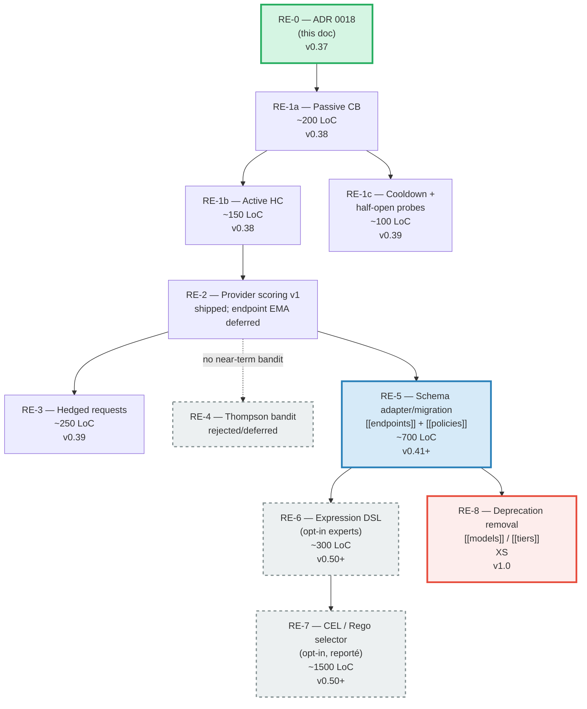

> **Promotion note (2026-04-28)**: status flipped from `proposed` to `accepted`
> after re-evaluation against two concrete user audiences: time-sensitive trading
> bots (where fast failover and tail-latency reduction are operational requirements,
> not nice-to-haves) and security-prevails customers (defense, banks, OIV) where
> declarative auditable policies replace implicit priority-chain semantics.
> ADR-0019, ADR-0020, and ADR-0022 land as `proposed` children of this accepted
> parent. ADR-0021 (Thompson sampling) was rejected before drafting because
> probabilistic exploration is incompatible with both audiences' demands for
> predictable routing.
>
> **Implementation status (2026-06-02)**: passive circuit breaker and active
> health-check modules exist in `src/routing/`; adaptive scoring is implemented
> as a provider-level v1 scorer under `[security] adaptive_scoring` (ADR-0019).
> Hedging remains proposed, and `[[endpoints]]` / `[[policies]]` are not public
> `AppConfig` fields. A read-only internal endpoint adapter exists in
> `src/routing/endpoints.rs` for ADR-0022 phase 0. Thompson sampling remains
> rejected/deferred; it is not a shipped or planned near-term routing primitive.

# ADR-0018: Nature-Inspired Routing — Topology vs Policy, Caddy-KISS, Biomimetic Primitives

## Context and Problem Statement

Grob's routing layer currently couples **two overlapping configuration systems** inside `~/.grob/config.toml`:

1. `[[models]]` with nested `mappings` — direct mapping from a request model name to a provider/model pair.
2. `[[tiers]]` — tier-based override that can redirect a mapping based on a tier label attached to the request (session, preset, or header).

The two systems were added at different points in Grob's history. `[[models]]` grew from the v0.20 era as a flat routing table. `[[tiers]]` was bolted on in v0.28 to support per-environment routing (dev/prod/paper-trading). They coexist today without a clean hierarchy:

- `[[tiers]]` overrides `[[models]]` **silently** when a tier matches, which produces the bug class described in **B-05** (`src/server/helpers.rs::resolve_provider_mappings` lines 16-34 — the tier branch short-circuits the models branch with no log, no warning, no fallback).
- There is no way to express "fall back from the tier mapping to the model mapping if the tier provider is down" without custom Rust code.
- Adding a new dimension (region, tenant, cost constraint) means a third coexisting system and the combinatorial explosion gets worse.

B-05 is not a routing bug in isolation. It is **the schema telling us it has outgrown its shape**. A patch on `resolve_provider_mappings` (the micro-fix landed as T-B05 in this same sprint) unblocks the immediate symptom but does not address the root cause: **two configuration axes that both claim to decide "where does this request go"**.

The strategic question is: do we keep patching, or do we rebuild the routing layer around a cleaner separation of concerns?

This ADR argues for the latter, defines the target model, and lays out a non-disruptive migration path (coexistence `v0.37`–`v0.45`, deprecation warnings, hard removal in `v1.0`).

### What "nature-inspired" means here

Grob's positioning includes a "bio-inspired" thread ([Sécurité Bio-inspirée](../../README.md), [[Storage Biomimetique]] concept, etc.). "Nature-inspired" in this ADR is **not decorative**. It refers to a specific, well-studied set of patterns from distributed-systems research that happen to have biological analogues:

| Pattern | Engineering name | Biological analogue |
|---|---|---|
| Passive circuit breaker with atomic counter + timer decrement | Caddy `max_fails` | Mammalian homeostasis — thresholded, self-resetting response |
| Active health probing with cooldown + half-open | Half-open circuit breaker | Immune response — test an antigen with a few cells before full recommitment |
| EMA of success-rate / latency per endpoint | Exponential moving average | Ant stigmergy — pheromone trails evaporate, good paths get reinforced |
| Hedged requests on p95 latency | Google "Tail at Scale" (2013) | Fish shoaling — redundant swimmers for resilience |
| Weighted bandit with Thompson sampling | Deferred / rejected for now | Scout-bee analogy kept as rejected design context only |

The analogues are **explanatory**, not mystical. Every primitive has a clear engineering semantic, a bounded LoC budget, and a test plan. If the biomimetic label is distracting, read it as "Caddy + Envoy + Google tail-at-scale, with Thompson sampling documented only as a rejected/deferred option".

## Decision Drivers

- **Kill the dual-schema class of bugs.** One system, one hierarchy, one way to express "where does this go".
- **Separate topology from policy.** Borrowed from Envoy: physical endpoints (identity, cost, region, capabilities) are one axis; how to choose among them is a separate axis. A topology change (new provider) should not require rewriting policy.
- **Zero-config KISS.** The minimum useful config must be ~3 lines of TOML, matching Caddy's `reverse_proxy` ergonomics. Grob ships with sane defaults for load balancing, fallback, circuit breaking, and health checks.
- **Progressive opt-in.** Every advanced primitive (CB, health check, hedging) is off by default. A new concern = one knob. You never pay for what you don't use. Bandit exploration is not in the near-term opt-in set.
- **No distributed state.** Grob stays a single binary. No Redis, no etcd, no sidecar. All routing state fits in RAM + optional persisted JSONL (see [ADR-0013](0013-storage-files-no-redb.md)).
- **No breaking change without grace.** We are not in a vacuum. Users have configs in production. Coexistence `[[models]]`/`[[tiers]]` with the new `[[endpoints]]`/`[[policies]]` requires explicit deprecation warnings, migration tooling, and removal gated behind `v1.0`.
- **Independently shippable phases.** The RE roadmap breaks into phases RE-0..RE-8, each of which delivers standalone value. RE-1a (passive CB) is useful even without any of RE-2..RE-8. We do not ship an 8-phase big bang.
- **Observable and testable.** Every new primitive needs a metric path and deterministic tests. Endpoint-specific operator surfaces such as `grob stats endpoints` wait until the endpoint schema/adapter exists.

## Considered Options

1. **Do nothing.** Leave `[[models]]`/`[[tiers]]` as-is. Patch B-05 (T-B05 landed this sprint) and move on.
2. **Patch the dual schema into a hierarchy.** Keep the two tables but define a strict precedence (`tiers` > `models` > defaults) and log every override. No new schema, no migration.
3. **Big-bang rewrite in v1.0.** Remove `[[models]]`/`[[tiers]]` in one release, ship `[[endpoints]]`/`[[policies]]`. Users migrate their config manually.
4. **Incremental rewrite with coexistence.** Ship an adapter/migration path first, then `[[endpoints]]`/`[[policies]]` alongside the legacy schema with deprecation warnings and migration tooling before removal in v1.0. (**Chosen.**)
5. **Adopt an existing routing library / sidecar (Envoy, LiteLLM, APISIX, Portkey).** Replace Grob's routing layer with an external dependency.

## Decision Outcome

**Chosen: option 4 — incremental rewrite with coexistence.**

The rewrite targets a schema structured along the **topology vs policy** axis borrowed from Envoy, with ergonomics borrowed from Caddy's `reverse_proxy` directive, and a catalogue of nature-inspired primitives (passive CB, active health check, cooldown half-open, adaptive scoring, hedged requests) layered as **opt-in** modules. Thompson sampling remains a rejected/deferred option, not part of the current implementation catalogue.

### Principle 1 — Topology vs policy

```
┌─────────────────────────────────────┐     ┌─────────────────────────────────────┐
│            TOPOLOGY                 │     │             POLICY                  │
│  WHO can serve this request        │     │  HOW to choose among them          │
├─────────────────────────────────────┤     ├─────────────────────────────────────┤
│  [[endpoints]]                      │     │  [[policies]]                       │
│  - id                               │     │  - match (glob / regex)             │
│  - backend (provider, model)        │     │  - lb_policy (cheapest | random |   │
│  - region                           │     │    round_robin | first | fastest |  │
│  - cost_in / cost_out               │     │    weighted)                        │
│  - capabilities                     │     │  - fallback (nested policy)         │
│  - circuit_breaker (opt-in)         │     │  - hedging (opt-in)                 │
│  - health_check (opt-in)            │     │  - fallback_trigger_codes           │
└─────────────────────────────────────┘     └─────────────────────────────────────┘
         ↑ physical / provider-facing                  ↑ logical / request-facing
         ↑ declared by infra team                      ↑ declared by app team
         ↑ changes when a provider appears             ↑ changes when the app needs
```

The cut follows Envoy's [cluster/endpoint model](https://www.envoyproxy.io/docs/envoy/latest/intro/arch_overview/upstream/cluster_manager) and agentgateway's separation of `targets` from `policies`. It is deliberately similar to what a network engineer expects — we are not reinventing the pattern, we are re-using a well-understood one.

### Principle 2 — Zero-config KISS

The minimum viable configuration is **three lines of TOML per endpoint**, no policy required. Grob infers:

- `lb_policy = "random"` across all endpoints that match the request model.
- `cost` from the provider's public pricing API (looked up at startup, cached; opt-in override via `cost_in_per_mtok`).
- `capabilities` from the model name (heuristics: `claude-opus-*` → coding, `deepseek-v3` → coding, etc.; opt-in override via `capabilities = […]`).
- `region = "global"` unless overridden.
- No circuit breaker, no health check, no hedging by default.

This ergonomic target is directly lifted from Caddy's `reverse_proxy example.com` — three tokens, and it works. Grob's target is three lines. Each additional line = one additional concern = one additional knob. You pay when you need it.

### Principle 3 — Nature-inspired primitives as opt-in layers

Each primitive below is **standalone and opt-in**. Turning it on is a few lines of TOML. None of them is required for the baseline to function. The order below matches the implementation phases RE-1..RE-3; former RE-4 is retained only as rejected/deferred design context.

#### Passive circuit breaker (RE-1a, Caddy-inspired)

Inspired by Caddy's passive health checks. Per endpoint:

- `max_fails` (default Caddy = 1; Grob default = 3 to avoid tripping on single transient errors).
- `fail_duration` (default = 0, i.e. disabled; opt-in like `"30s"`).

Mechanism: atomic counter per endpoint. Each failed dispatch increments. A tokio task decrements after `fail_duration`. If the counter ≥ `max_fails`, the endpoint is marked down. **No state machine, no locks on the hot path.** This matches Caddy's KISS philosophy: the cost of a failed dispatch is one atomic add; the cost of a successful dispatch is zero.

Zone: `src/routing/circuit_breaker.rs` (new module). ~200 LoC. Sprint S5 owns T-R1a.

#### Active health checks (RE-1b, Caddy-inspired)

Inspired by Caddy's `health_uri`/`health_interval`/`health_timeout`/`health_status` directives. Per endpoint:

- `health_uri` (mandatory to activate).
- `health_interval` (default `"30s"`).
- `health_timeout` (default `"5s"`).
- `health_status` (default `"2xx"`).

Mechanism: tokio task per endpoint polls the health URI. On failure, endpoint is marked down. **Separate concern from the passive CB** — an endpoint can have both, neither, or either. When both are enabled, the endpoint is down if either declares it down.

Zone: `src/routing/health_check.rs` (new file under the same module). ~150 LoC. Sprint S5 owns T-R1b (follows T-R1a merge).

#### Cooldown + half-open probes (RE-1c, mammalian homeostasis)

Immune-response pattern. When an endpoint is tripped (by passive CB or active health check):

1. Enter `cooldown` for a configurable duration (default `"60s"`).
2. On cooldown end, enter `half-open` state: allow up to N probe requests (default 3).
3. If all probes succeed, close circuit (endpoint up).
4. If any probe fails, re-trip and reset cooldown.

This is a standard half-open circuit breaker pattern (see Martin Fowler, [CircuitBreaker](https://martinfowler.com/bliki/CircuitBreaker.html)). The "mammalian" framing emphasizes that **the response is graduated** — you don't fully commit on the first positive signal, you test with a few cells first. Opt-in via `cooldown = "60s"` in `[endpoints.circuit_breaker]`.

~100 LoC. Sprint S6 or later.

#### Adaptive scoring (RE-2, ant stigmergy)

Current implementation: provider-level adaptive scoring in
`src/security/provider_scorer.rs` (ADR-0019), tracking rolling success rate,
latency EWMA, and recency per provider. Metrics are `grob_provider_*`.

Deferred target: per-endpoint EMA can track `success_rate_ema`,
`latency_p95_ema`, and `cost_actual_ema` only after stable endpoint identities
exist. Do not add `~/.grob/routing/endpoints.jsonl` or `grob stats endpoints`
until ADR-0022 has an adapter/migration path.

The biological framing: **good paths accumulate pheromone**. Ants don't centrally decide which trail is best; each success reinforces the trail for future ants, each failure lets the trail evaporate. EMA with exponential decay is the engineering form of this. The point is not romance — it is that **online, local, per-request feedback can drive good global behaviour without a central coordinator**. In the current tree this is provider-level adaptive scoring (ADR-0019), not endpoint-level EMA.

Provider-level v1 is already shipped. Endpoint-level RE-2 remains deferred.

#### Hedged requests (RE-3, fish shoaling / Google Tail at Scale)

Target design: when a request to the primary provider/endpoint exceeds a fixed
threshold or the future endpoint's `latency_p95_ema`, Grob fires a **second**
request to the next-best eligible provider/endpoint. Whichever returns first
wins; the other is cancelled and audited under ADR-0020's spend protocol.

Core reference: Dean & Barroso, [The Tail at Scale](https://research.google/pubs/pub40801/), CACM 2013. The empirical result: hedging on p95 adds ~5% request amplification but reduces p99 latency by up to 10×. Cost `+50%` punctually ≪ cost of a timeout `+300%`. The biological analogue (redundant swimmers in a fish shoal) is illustrative; the engineering argument stands on its own.

Configuration: `hedging = { p95_trigger = true, p95_factor = 1.5 }`. Zone: `src/server/dispatch/mod.rs` (integrates with the existing provider loop).

~250 LoC. v0.39.

#### Weighted bandit / Thompson sampling (rejected/deferred, scout bees)

Thompson sampling remains design context, not an implementation phase. It would
replace deterministic ordering with probabilistic exploration: sample a
posterior for each endpoint, pick the highest draw, and update the posterior
after the request.

That is useful in ad-serving-style optimization, but it conflicts with Grob's
current constraints:

- The current schema has provider mappings, not stable endpoint identities.
- Security-prevails deployments need predictable, auditable routing decisions.
- Exploration can spend money on a worse provider by design, so it needs an
  explicit spend reservation and audit protocol before it is acceptable.
- ADR-0019 already provides a simpler provider-level scorer that handles the
  immediate failure-recovery problem.

If this is revisited, it needs a new ADR after ADR-0022 has an internal
endpoint adapter and after hedging/spend audit semantics are proven. It should
not be implemented as a quick `lb_policy = "bandit"` patch on the legacy
`[[models]]` schema.

### Principle 4 — Migration path with 6-month coexistence

Not a big bang. The trajectory:

```mermaid
flowchart LR
    v037[v0.37<br/>RE-0 ADR]:::current
    v038[v0.38<br/>RE-1 CB + HC<br/>legacy still works]
    v039[v0.39<br/>RE-2 EMA + RE-3 hedge<br/>legacy still works]
    v040[v0.40<br/>RE-4 removed/deferred<br/>legacy still works]
    v041[v0.41<br/>RE-5 schema adapter/migration<br/>coexistence begins]:::milestone
    v042[v0.42-v0.44<br/>coexistence<br/>warning log on startup<br/>if [[models]] detected]
    v045[v0.45<br/>legacy_routing feature flag<br/>defaults to false<br/>explicit opt-in required]
    v1[v1.0<br/>legacy removed]:::breaking

    v037 --> v038 --> v039 --> v040 --> v041 --> v042 --> v045 --> v1

    classDef current stroke:#27AE60,stroke-width:3px,fill:#D5F5E3
    classDef milestone stroke:#2980B9,stroke-width:3px,fill:#D6EAF8
    classDef breaking stroke:#E74C3C,stroke-width:3px,fill:#FDEDEC
```

Key milestones:

1. **v0.37 (this ADR, RE-0).** No code change to `[[models]]`/`[[tiers]]`. New routing concepts documented, no schema change yet. T-B05 (already landed in S5) patches the silent-override bug so coexistence is safe.
2. **v0.38 (RE-1a + RE-1b).** Passive CB and active health checks land in the new `src/routing/` module. Wired into the existing dispatch layer (`src/server/dispatch/mod.rs`) without changing the schema. Both primitives are off by default. **Legacy schema untouched.**
3. **v0.39 (RE-2 + RE-3).** Provider-level adaptive scoring is the delivered v1; hedged requests remain proposed until spend reservation, cancellation billing, and audit semantics are documented and tested.
4. **v0.40 (former RE-4).** Thompson sampling is removed from the near-term roadmap. No `lb_policy = "bandit"` is added to the legacy schema.
5. **v0.41 (RE-5).** `[[endpoints]]` and `[[policies]]` start as an adapter/migration path, not a cut-over. The read-only adapter exists in `src/routing/endpoints.rs`; both schemas may be read by the config loader only once golden-file migration tests and clear startup warnings exist.
6. **v0.42–v0.44 (coexistence).** Each startup log emits:

   ```
   WARN routing: legacy [[models]]/[[tiers]] schema detected.
       Run the routing migration command to generate an [[endpoints]]/[[policies]] config.
        Legacy schema support will be removed in v1.0.
   ```

7. **v0.45 (opt-in legacy).** The legacy schema is gated behind `[features] legacy_routing = false` (default). Users who have not migrated hit a startup error that tells them exactly what to do. This is the "loud" phase — we want users to know.
8. **v1.0 (hard removal).** `legacy_routing` feature flag removed. Legacy code paths deleted. The routing migration command is kept for one more version as a convenience, then removed in v1.1.

The 6-month coexistence window (≈ v0.41 → v0.45 at Grob's current release cadence of ~1 minor/month) is a **deliberate choice**, not a compromise. It is long enough for enterprise users on quarterly-upgrade cycles to pick up at least one warning-only release before the opt-in phase.

### Principle 5 — Link to B-05 (the bug that prompted this)

**B-05 is fixed *before* this ADR's implementation starts**, not as part of it.

Rationale:

- T-B05 (this sprint) is ~20 LoC in `src/server/helpers.rs`. Making the tier override explicit (log line, precedence rule, fallback to models branch on tier miss) removes the silent-failure class.
- The fix **validates the test strategy** for the routing layer. The regression tests added by T-B05 will be reused as the legacy-coexistence test fixture for RE-5.
- Shipping RE-5 on top of an unfixed B-05 would mean debugging two routing bugs simultaneously during migration.

The alternative — skip T-B05 and jump straight to RE-5 — was considered and rejected. It would have saved 2 commis-hours at the cost of a much harder migration, with the legacy schema genuinely broken the whole way.

### What this ADR does *not* cover

- **Service mesh sidecar** (Istio, Linkerd, Envoy-as-sidecar). Grob stays a single binary. See [ADR-0014](0014-mesh-wireguard-kiss.md) for the mesh story.
- **Distributed state** (Redis, etcd, etc.). All routing state is RAM + local JSONL.
- **ML classification of requests**. Policies stay declarative. A request's model field + glob matches an endpoint; that is all.
- **An immediate breaking change**. See the migration path above.
- **CEL / Rego policy DSL**. Deferred to RE-6 and RE-7 (v0.50+). Named presets (`cheapest`, `random`, `round_robin`, `first`, `fastest`, `weighted`) cover 95% of cases. Expression DSL is opt-in expert-only.

## Pros and Cons of the Options

### Option 1 — Do nothing

**Pros:**

- Zero work.
- No migration risk.

**Cons:**

- B-05 is fixed, but the schema remains fragile. The next dimension (region, tenant, compliance zone) will re-create the same class of bug.
- Every advanced primitive (CB, HC, hedging) has no natural home in the schema. Each one would need a bespoke extension.
- The "one way to do it" principle is violated indefinitely.

### Option 2 — Patch the dual schema into a hierarchy

**Pros:**

- No new schema, no migration.
- Cheap in LoC (~50-100).

**Cons:**

- Makes the schema harder to reason about, not easier. Users now have to remember precedence rules.
- Adding a third dimension (region) means a 3-level precedence ladder. Not sustainable.
- Does not unblock the Envoy-style separation of topology from policy.

### Option 3 — Big-bang rewrite in v1.0

**Pros:**

- Cleanest end state.
- No coexistence code to maintain.

**Cons:**

- Every user with a production config has to migrate in lockstep with v1.0.
- No incremental value delivery. RE-1 circuit breaker is useful *today*; forcing it to wait for v1.0 is wasteful.
- High blast radius if the migration has a bug — the rollback is "go back to v0.x", which is painful.

### Option 4 — Incremental rewrite with coexistence (chosen)

**Pros:**

- Value ships in every RE-* phase independently.
- Users migrate on their own schedule within the coexistence window.
- Coexistence code is bounded (~200 LoC in `src/cli/config.rs` during v0.41–v0.45) and has a hard removal date.
- The routing migration command is tested against real configs before v1.0.

**Cons:**

- ~200 LoC of coexistence code to write, test, and eventually delete.
- The schema loader is temporarily more complex than either endpoint state would be.
- Two sets of documentation during coexistence (we mitigate with a clear "legacy" banner on the old docs).

### Option 5 — Adopt an existing routing library / sidecar

Envoy, LiteLLM, APISIX, Portkey were all evaluated.

**Pros:**

- Existing, battle-tested code.
- Big community.
- Some (LiteLLM, Portkey) are LLM-specific.

**Cons:**

- All are either process-level sidecars (Envoy, APISIX) or pull in heavy dependencies (LiteLLM is Python; Portkey is a cloud gateway).
- Grob's positioning is **single binary, embeddable, no sidecar** ([ADR-0014](0014-mesh-wireguard-kiss.md) makes this explicit for the mesh; the same constraint applies here).
- The LLM-specific routing (DLP, Pledge, HIT, Sokolsky, Decision Tokens) is not something an off-the-shelf library provides. We would end up writing the same logic as a plugin to someone else's runtime.
- Loss of the tight integration with Grob's policy engine ([ADR-0006](0006-policy-engine-encrypted-audit-hit-gateway.md)) and decision tokens ([ADR-0016](0016-decision-tokens-transparent-routing.md)).

Rejected on architectural grounds, not on quality of the external libraries.

## Consequences

### Positive

- **Eliminates the B-05 class of bug.** One schema, one precedence rule (policies match → endpoints selected → lb_policy picks → fallback on failure).
- **Envoy-shaped mental model.** Every experienced SRE already knows topology vs policy. No novel concepts to learn.
- **Caddy-shaped ergonomics.** A Grob user who has used Caddy will write a correct config in 30 seconds.
- **Each RE phase ships independently.** RE-1a (CB) is useful without any of the others. This is a real reduction in blast radius per release.
- **Bio-inspired framing** gives the project a coherent narrative for a hard problem. It is not just decoration — each accepted primitive has an engineering citation (Caddy, Envoy, Google Tail at Scale), while Thompson sampling is kept as rejected/deferred context.
- **6-month coexistence** is humane for users with production configs.
- **A routing migration command** becomes a pattern we can reuse for future schema changes.

### Negative

- **~3100 LoC of new code** across 6 versions (v0.37 → v1.0). Not trivial.
- **Coexistence code in `src/cli/config.rs`** for ~6 months. Bounded but non-zero maintenance cost.
- **Two docs sections** during coexistence (legacy + new). We mitigate with a prominent banner on legacy pages.
- **Risk of feature creep.** Each RE-* phase must stay scoped. The roadmap already defers RE-6 (expression objective) and RE-7 (CEL/Rego) explicitly because they are not needed for 95% of users.
- **Risk of "bio-inspired label" being perceived as marketing.** Mitigated by citing the engineering sources (Caddy, Envoy, Dean & Barroso 2013) in every active phase ADR and keeping Thompson sampling clearly marked as rejected/deferred.

### Confirmation

Compliance with this ADR will be verified by:

1. **Per-phase ADRs / status notes** — ADR-0019 documents provider scoring v1, ADR-0020 documents hedging as proposed, and ADR-0022 documents the endpoint-schema target plus the read-only adapter. Circuit breaker and health-check modules are already present and should get a follow-up ADR/status note if their shipped behavior becomes more than local implementation detail.
2. **Tests** at every phase — unit tests for each primitive, integration tests for the coexistence loader in v0.41.
3. **Routing migration golden-file tests** — a fixture directory of legacy configs, each with an expected new-schema output.
4. **Startup warning log** — explicit assertion in CI that v0.42+ logs the deprecation warning when `[[models]]` is present.
5. **v1.0 grep check** — CI job that fails if any reference to `[[models]]` or `[[tiers]]` remains in the codebase after the v1.0 removal milestone.

## More Information

### Internal references

- [ADR-0003 — Regex routing engine](0003-regex-routing-engine.md) — the current routing model that this ADR supersedes for the endpoint-selection layer. The regex task-type classification in `src/routing/classify/mod.rs` is orthogonal and stays.
- [ADR-0013 — Storage on atomic files + append-only journal](0013-storage-files-no-redb.md) — persistence substrate for any future endpoint-level EMA stats and CB state.
- [ADR-0014 — Mesh networking WireGuard KISS](0014-mesh-wireguard-kiss.md) — the single-binary / no-sidecar constraint that forces an in-process routing layer.
- [ADR-0016 — Decision Tokens](0016-decision-tokens-transparent-routing.md) — routing decisions emit tokens; the new schema does not change token format.
- [ADR-0017 — Sokolsky LogBackend](0017-sokolsky-log-backend.md) — routing decisions go to the audit plane; unchanged by this ADR.

### External references

- Matt Klein, [Envoy's architectural model](https://www.envoyproxy.io/docs/envoy/latest/intro/arch_overview/intro/intro) — clusters (topology) vs listeners/filters (policy).
- Matt Holt, [Caddy `reverse_proxy` directive](https://caddyserver.com/docs/caddyfile/directives/reverse_proxy) — the ergonomic benchmark for this ADR. Every example we ship should be benchmarked against Caddy's equivalent in lines of config.
- Jeffrey Dean & Luiz André Barroso, [The Tail at Scale](https://research.google/pubs/pub40801/), *Communications of the ACM*, Vol. 56, No. 2, 2013 — the canonical reference for hedged requests.
- Daniel J. Russo, Benjamin Van Roy, Abbas Kazerouni, Ian Osband & Zheng Wen, [A Tutorial on Thompson Sampling](https://arxiv.org/abs/1707.02038), *Foundations and Trends in Machine Learning*, 2018 — retained as rejected/deferred design context, not an implementation dependency.
- Martin Fowler, [CircuitBreaker](https://martinfowler.com/bliki/CircuitBreaker.html) — the half-open state pattern.
- Leslie Lamport, [The Temporal Logic of Actions](https://lamport.azurewebsites.net/pubs/lamport-actions.pdf) — state-machine framing used informally to argue the CB primitive has no implicit states.
- Marco Dorigo & Thomas Stützle, *Ant Colony Optimization*, MIT Press, 2004 — stigmergy as a distributed optimisation primitive.

### Internal discussion threads

- Backlog PO — Phase RE (section complète) — internal Obsidian vault; source of the phase breakdown, effort estimates, and schema examples.
- Decisions Architecte — D-12 nature-inspired routing — internal Obsidian vault; architect brief referencing this ADR.
- Sprint S5 shared-state — T-R0 delivery, commis-3 assignment, 3/3 unanimity required on `docs/decisions/**`.

### Target schema examples

**Minimum (zero-config, 95% of users):**

```toml
[[endpoints]]
id = "or-m25"
backend = { provider = "openrouter", model = "minimax/minimax-m2.5" }
```

Three lines. No policy. `lb_policy = "random"` across matching endpoints is implicit. Cost pulled from the OpenRouter pricing API. Capabilities inferred from the model name.

**Intermediate (one policy, two endpoints):**

```toml
[[endpoints]]
id = "or-m25"
backend = { provider = "openrouter", model = "minimax/minimax-m2.5" }

[[endpoints]]
id = "anthropic-sonnet"
backend = { provider = "anthropic", model = "claude-sonnet-4-6" }

[[policies]]
match = "claude-sonnet-*"
lb_policy = "cheapest"
fallback = "random"
```

**Advanced (CB + health check + hedging):**

```toml
[[endpoints]]
id = "or-m25"
backend = { provider = "openrouter", model = "minimax/minimax-m2.5" }
region = "global"
cost_in_per_mtok = 0.12         # opt-in override if pricing API wrong
capabilities = ["coding", "chat"]

[endpoints.circuit_breaker]
max_fails = 3                   # default Caddy = 1; Grob default = 3
fail_duration = "30s"           # default = 0 (disabled)
cooldown = "60s"                # post-trip cooldown (RE-1c)

[endpoints.health_check]
uri = "https://openrouter.ai/api/v1/models"
interval = "30s"
timeout = "5s"
status = "2xx"

[[policies]]
match = "claude-sonnet-*"
lb_policy = "cheapest"
fallback = "random"
hedging = { p95_trigger = true, p95_factor = 1.5 }
fallback_trigger_codes = [429, 500, 502, 503]
```

### Phase flowchart (RE-0 to RE-8)



### Effort summary

| Phase | LoC | Version | Ship target | Critical path |
|---|---|---|---|---|
| RE-0 | ~0 (doc only) | v0.37 | **this sprint S5** | yes |
| RE-1a | ~200 | v0.38 | S5 / S6 | yes |
| RE-1b | ~150 | v0.38 | S5 / S6 | yes |
| RE-1c | ~100 | v0.39 | S7 | no |
| RE-2 | shipped v1 / endpoint deferred | current | done for provider scoring | no |
| RE-3 | ~250 | v0.39 | S7 | no |
| RE-4 | deferred | none | none | no |
| RE-5 | ~700 | v0.41+ | S9+ | yes (blocks v1.0) |
| RE-6 | ~300 | v0.50+ | deferred | no |
| RE-7 | ~1500 | v0.50+ | deferred | no |
| RE-8 | XS | v1.0 | ~S15 | yes |
| **Total shipping** | **~2000** | **v0.37 -> v1.0** | **~9 months** | |

Each phase is independently shippable. Stopping the project at any point after RE-1 leaves Grob strictly better off than today.

### Pseudocode sketches — one per primitive

These are **sketches**, not final code. They commit to a shape, not to line-by-line implementation.

#### Passive CB (RE-1a)

```rust
// src/routing/circuit_breaker.rs
pub struct PassiveCircuitBreaker {
    fail_count: AtomicU32,
    max_fails: u32,
    fail_duration: Duration,
    tripped_until: AtomicU64, // epoch seconds, 0 = not tripped
}

impl PassiveCircuitBreaker {
    pub fn is_up(&self) -> bool {
        let until = self.tripped_until.load(Ordering::Relaxed);
        until == 0 || now_secs() >= until
    }

    pub fn record_failure(&self) {
        // NOTE: Racy by design — approximate count, strict guarantees not needed.
        let c = self.fail_count.fetch_add(1, Ordering::Relaxed) + 1;
        if c >= self.max_fails && self.fail_duration.as_secs() > 0 {
            self.tripped_until.store(
                now_secs() + self.fail_duration.as_secs(),
                Ordering::Relaxed,
            );
        }
    }

    pub fn record_success(&self) {
        self.fail_count.store(0, Ordering::Relaxed);
    }
}
```

Properties:

- Hot path is **one atomic load + one comparison** to decide `is_up`.
- No mutex, no sync primitive beyond atomics.
- The decrementer is implicit: `tripped_until` is an absolute timestamp, so "decrementing" is actually "letting time pass". No background task needed for RE-1a.

#### Active HC (RE-1b)

```rust
// src/routing/health_check.rs
pub struct ActiveHealthCheck {
    uri: Url,
    interval: Duration,
    timeout: Duration,
    expected_status: StatusClass, // 2xx, 3xx, …
    last_ok: AtomicBool,
}

impl ActiveHealthCheck {
    pub async fn spawn(self: Arc<Self>) {
        let mut interval = tokio::time::interval(self.interval);
        loop {
            interval.tick().await;
            let ok = self.probe().await;
            self.last_ok.store(ok, Ordering::Relaxed);
        }
    }

    async fn probe(&self) -> bool {
        match tokio::time::timeout(self.timeout, http_get(&self.uri)).await {
            Ok(Ok(resp)) => self.expected_status.matches(resp.status()),
            _ => false,
        }
    }
}
```

Properties:

- One tokio task per endpoint with HC enabled. Grob already runs many such tasks (Sokolsky witnesses, MCP watchers), so the model is familiar.
- `probe()` is a single HTTP call; no retries, no backoff. If the user wants retries they wrap the URI with a proxy that does retries.
- Combined "is the endpoint up" check is `cb.is_up() && hc.last_ok.load()`.

#### Adaptive provider scoring (RE-2)

The shipped v1 is `src/security/provider_scorer.rs`, not
`src/routing/stats.rs`. It stores one provider score with a rolling success-rate
window, latency EWMA, confidence decay, and circuit-breaker overlay. See
ADR-0019 for formula and tests.

Properties:

- Constant-memory per provider.
- No endpoint identity required.
- Metrics are `grob_provider_score`, `grob_provider_latency_ewma_ms`, and
  `grob_provider_success_rate`.
- Endpoint-level EMA is deferred until ADR-0022 has a stable adapter/migration
  path.

#### Hedged requests (RE-3)

```rust
// src/server/dispatch/hedged.rs
pub async fn hedged_dispatch(
    primary: &Endpoint,
    secondary: &Endpoint,
    req: Request,
) -> Result<Response, DispatchError> {
    let primary_fut = primary.send(req.clone());
    let trigger = tokio::time::sleep(primary.p95_ema().mul_f64(1.5));

    tokio::select! {
        res = &mut primary_fut => res,
        _ = trigger => {
            let secondary_fut = secondary.send(req);
            tokio::select! {
                p = primary_fut => p,
                s = secondary_fut => s,
            }
        }
    }
}
```

Properties:

- The hedge fires **only if the primary hasn't responded by `1.5 * p95_ema`**. For requests that are fast, the secondary is never fired.
- Whichever returns first wins. The other future is dropped (tokio cancels it).
- Cost amplification is bounded by `p(primary > p95) ≈ 5%`, so hedge cost is `~5% × secondary_cost`.

#### Thompson sampling (former RE-4)

No implementation sketch is retained for Thompson sampling. Keeping pseudo-code
for `src/routing/bandit.rs` made the ADR read as an implementation plan even
though the primitive is rejected/deferred. If revisited, it needs a new ADR with
endpoint identity, spend reservation, audit, and deterministic test constraints.

### Glossary — biomimetic labels vs engineering primitives

| Biomimetic label | Engineering primitive | Where it lives in Grob |
|---|---|---|
| Mammalian homeostasis | Half-open circuit breaker with cooldown | `src/routing/circuit_breaker.rs` (RE-1c) |
| Ant stigmergy / pheromone | Adaptive score from recent success/latency | `src/security/provider_scorer.rs` today; endpoint-level target deferred |
| Fish shoaling / redundant swimmers | Hedged requests on p95 trigger | `src/server/dispatch/hedged.rs` (RE-3) |
| Scout bees / exploration | Thompson sampling with epsilon-greedy exploration | Rejected/deferred; no `src/routing/bandit.rs` |
| Mycelium network | (Not used — misleading. Distributed consensus is not required here.) | — |
| Swarm intelligence | (Not used — too vague. Every specific pattern above is named precisely.) | — |

The labels in the left column are **mnemonic and illustrative**. They are not load-bearing — the code in `src/routing/` uses the engineering names. If a future maintainer finds the biomimetic framing distracting, deleting it from code comments and keeping it only in ADR prose is explicitly sanctioned.

### Migration example — before and after

Before (current `~/.grob/config.toml` in production):

```toml
[[models]]
name = "claude-sonnet-4-6"
mappings = [
    { provider = "anthropic", model = "claude-sonnet-4-6", weight = 5 },
    { provider = "openrouter", model = "anthropic/claude-sonnet-4-6", weight = 1 },
]

[[models]]
name = "claude-opus-4-7"
mappings = [
    { provider = "anthropic", model = "claude-opus-4-7", weight = 1 },
]

[[tiers]]
name = "paper-trading"
match = { header = "x-env", value = "paper" }
override = { provider = "deepseek", model = "deepseek-v3.2" }
```

After (v0.41+ `~/.grob/config.toml`, after the routing migration command):

```toml
# Topology — the physical endpoints we can talk to.
[[endpoints]]
id = "anthropic-sonnet"
backend = { provider = "anthropic", model = "claude-sonnet-4-6" }

[[endpoints]]
id = "or-anthropic-sonnet"
backend = { provider = "openrouter", model = "anthropic/claude-sonnet-4-6" }

[[endpoints]]
id = "anthropic-opus"
backend = { provider = "anthropic", model = "claude-opus-4-7" }

[[endpoints]]
id = "deepseek-v32"
backend = { provider = "deepseek", model = "deepseek-v3.2" }

# Policy — how we choose, given a request.
[[policies]]
match = "claude-sonnet-*"
endpoints = ["anthropic-sonnet", "or-anthropic-sonnet"]
lb_policy = "weighted"
weights = { "anthropic-sonnet" = 5, "or-anthropic-sonnet" = 1 }
fallback = "random"

[[policies]]
match = "claude-opus-*"
endpoints = ["anthropic-opus"]
lb_policy = "first"

# Paper-trading override — a dedicated policy for the x-env=paper request header.
[[policies]]
match = "*"
when = { header = "x-env", value = "paper" }
endpoints = ["deepseek-v32"]
lb_policy = "first"
priority = 100  # higher = evaluated first
```

What the migration script does:

1. For every `[[models]].mappings` entry, emit a unique `[[endpoints]]` and build an id from `<provider>-<slug(model)>` (dedup if multiple `[[models]]` share a mapping).
2. For every `[[models]]` entry with `N > 1` mappings, emit a `[[policies]]` with `lb_policy = "weighted"` if weights differ, else `"random"`.
3. For every `[[tiers]]`, emit a dedicated `[[policies]]` with `when` describing the match predicate and `priority = 100` to ensure tier policies evaluate first.
4. Emit a banner comment at the top describing the migration date and the original config path.
5. Write the output to `~/.grob/config.toml.migrated` by default — the user moves it into place once they've reviewed.

### Schema surface — full reference

The fields expected on `[[endpoints]]`:

| Field | Type | Default | Meaning |
|---|---|---|---|
| `id` | string | **required** | Unique within the config. Used for ownership of EMA stats and CB state. |
| `backend` | table `{ provider, model }` | **required** | The physical pair. Keys match the existing provider registry. |
| `region` | string | `"global"` | Used for `when = { region = … }` predicates. Free-form tag. |
| `capabilities` | array of string | inferred | Used for `when = { capability = "coding" }` predicates. |
| `cost_in_per_mtok` | float | inferred from pricing API | Input tokens cost, USD per million tokens. |
| `cost_out_per_mtok` | float | inferred from pricing API | Output tokens cost, USD per million tokens. |
| `[endpoints.circuit_breaker]` | table | — | Opt-in. See RE-1a. |
| `[endpoints.health_check]` | table | — | Opt-in. See RE-1b. |

The fields expected on `[[policies]]`:

| Field | Type | Default | Meaning |
|---|---|---|---|
| `match` | string | **required** | Glob on the request model name (`"claude-sonnet-*"`, `"*"`). |
| `when` | table | `{}` | Extra predicates: `region`, `capability`, `header`, `tenant`. |
| `endpoints` | array of endpoint id | inferred | If omitted, all endpoints whose model matches `match`. |
| `lb_policy` | enum | `"random"` | One of `random`, `round_robin`, `first`, `weighted`, `cheapest`, `fastest`. |
| `weights` | table `{ id = number }` | — | Required only when `lb_policy = "weighted"`. |
| `fallback` | policy name | — | Nested fallback, Caddy-style. |
| `fallback_trigger_codes` | array of int | `[429, 500, 502, 503, 504]` | HTTP codes that trigger fallback. |
| `hedging` | table | — | Opt-in. See RE-3. |
| `priority` | int | `0` | Evaluated first if higher. Used for tier-like overrides. |

The `lb_policy` values:

- `random` — uniform pick. Default.
- `round_robin` — deterministic rotation. Useful for tests.
- `first` — always the first endpoint in the list. Degenerate fallback.
- `weighted` — classic weighted random, requires `weights`.
- `cheapest` — pick the endpoint with lowest `cost_in + cost_out`.
- `fastest` — pick the endpoint with lowest `latency_p95_ema` (requires deferred endpoint-level RE-2).
A future `expression` policy (RE-6) would allow arbitrary arithmetic on fields like `0.6 * cost_in + 0.4 * latency_p95_ms`. Deferred; not in scope for this ADR.

### Why not just "config as code"?

A natural alternative to a new TOML schema is **config as Rust / Starlark / Cue / Jsonnet**. Grob already ships presets in Rust code (`src/preset/`), so why not just write policies as code?

Rejected for this ADR for three reasons:

1. **Operators are not Rust programmers.** The Grob user base includes SREs editing `~/.grob/config.toml` in a production environment. TOML is the established contract.
2. **Static analysability.** A TOML schema can be checked at startup for unreachable policies, duplicate ids, missing endpoints, etc. A code-as-config world requires running arbitrary code to know if it is correct.
3. **Diff friendliness.** Config changes land in git. TOML diffs review well. Starlark diffs less so.

The escape hatch for power users (RE-6 expression DSL) is deliberately scoped to **arithmetic on named fields**, not full Turing-complete scripting.

### Why coexist for 6 months, not 3 or 12?

- **3 months is too short.** Grob users include enterprise clients on quarterly upgrade cycles. A 3-month window means some of them never see a warning-only release.
- **12 months is too long.** Coexistence code decays — it hasn't been exercised in production because the new code path is what users adopt first. At 12 months, the legacy code is stale and at high risk of regressing without anyone noticing.
- **6 months at Grob's release cadence ≈ 6 minor versions.** Each minor version is an opportunity to surface the warning. Users who upgrade once per minor see the warning six times. Users who upgrade once per quarter see it twice. Users who only upgrade on v1.0 get the error.

This is a judgement call, not a mathematical derivation. A future ADR can shorten the window to 3 months if adoption data shows migration is fast.

### Open questions (not blocking this ADR)

- **Endpoint identity across restarts.** Endpoint-level EMA stats need stable IDs before persistence makes sense. The keying decision is deferred to the ADR-0022 adapter/migration work, not to the provider-level scorer.
- **Cost inference robustness.** The OpenRouter pricing API is rate-limited. What is the fallback if the lookup fails at startup? Probably: cache-first, hard-coded defaults for known providers, opt-in override in config. Decision deferred to RE-5 ADR.
- **Policy ordering for overlapping matches.** If two `[[policies]]` both match a request, which wins? Current proposal: first match in TOML order, with a startup warning if overlaps detected. To be confirmed in RE-5 ADR.
- **Hedging cost accounting.** A hedged request that loses the race is still billed by the provider. How do we surface this in `grob spend`? Decision deferred to RE-3 ADR.

These are deliberate deferrals — each has a clear home in a later phase ADR. Raising them here would delay the RE-0 signal without changing the core design.
