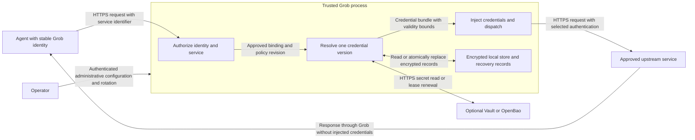

# ADR-0031: Credential Routing With Optional Vault and Local Recovery

## Scope and implementation status

This decision defines the credential-routing extension and its operation without
Vault. The explicit HTTP service gateway now implements local encrypted authority,
Vault/OpenBao KV v2 reads, bounded encrypted recovery, hot rotation and durable
revocation. See [Route service credentials](../how-to/route-service-credentials.md)
for supported configuration, commands and qualification. Dynamic secret engines
and lease renewal are not implemented; Vault Agent manages authentication tokens.

The shipped LLM-provider path already has stable virtual agent keys, live
`secret:<name>` references, encrypted local storage and file-based injection from
Vault Agent. See [Manage Secrets](../how-to/manage-secrets.md). The additional
rules below describe the contract. The implementation uses exact path matching
and pinned connection addresses, and rejects configurations combining this gateway
with LLM policies until those policies can be evaluated for opaque HTTP traffic.

## Context and problem statement

An agent should authenticate once to Grob while Grob chooses the upstream token or
password for an authorized service and injects it immediately before transport.
An operator must be able to replace that credential without updating the agent.

Vault must be optional. A standalone installation needs the same routing,
injection, rotation and authorization behavior using the local encrypted store.
A deployment that does use Vault also needs a bounded recovery policy for outages.
Neither case may weaken the authorizing-dependency contract in
[ADR-0030](0030-fail-closed-dependency-contract.md).

## Decision

Use one authorization and injection pipeline with interchangeable credential
sources. Make local operation a supported mode, rather than a reduced feature set.
Separate deliberate standalone operation from temporary loss of Vault.

### Modes and feature parity

These are design names. Authority is explicitly selected by `grob credentials
local` or `grob credentials vault`; recovery is configured per binding.

| Mode | Credential authority | If Vault is absent or unavailable |
|---|---|---|
| Standalone local | Locally provisioned encrypted records | Starts and serves authorized routes without contacting Vault. Local rotation and revocation remain available. |
| Vault required | Vault/OpenBao | Routes requiring unavailable credentials refuse dispatch. Unaffected local routes may continue. |
| Vault with bounded recovery | Vault/OpenBao, with an explicitly allowed encrypted snapshot per binding | Uses only an eligible, previously verified snapshot during a classified availability failure; otherwise refuses dispatch. |

Standalone local is the default for new installations. Vault recovery is disabled
unless an operator enables it for a particular binding and sets a finite offline
age. A missing Vault configuration never silently selects a different authority.

Every mode must support the same service identifiers, agent restrictions, exact
destination matching, Bearer/API-key/Basic injection, protected gateway responses,
rotation and audit events. Only credential acquisition and renewal differ.
Vault-generated dynamic credentials still require their issuer for creation or
renewal; local operation cannot manufacture or extend an external lease.

### Shared authorization and injection boundary

An administrator binds a service to an exact HTTPS origin, permitted methods and
canonical paths, allowed authenticated agent/tenant identities, a credential alias
and an injection scheme. Matching includes the port. An agent selects a service
identifier, never a Vault path, backend, raw destination URL or secret value.
Ambiguous policy matches are rejected.

Authentication and authorization run before secret resolution in every mode.
Identity comes from verified transport authentication, not a forwarded header or
request-body claim. A failure of agent authentication, policy evaluation or an
applicable budget check remains a denial even when a local secret is available.
Standalone deployments must also use an authentication method that can operate
without external identity services; local secret storage does not bypass a failed
identity provider.

Strip caller credentials before injecting the selected authentication. Restrict
injection to the configured authentication fields; reject control over Host,
hop-by-hop and framing headers. Do not inject secrets into query strings, arbitrary
payload text, logs or URLs. Basic authentication encodes a username/password pair;
HTTPS supplies transport confidentiality.

Use the same canonical URL for policy checks and transport. Reject ambiguous path
encodings, userinfo and unapproved destinations. Validate resolved addresses at
connection time against the service's network policy to prevent DNS rebinding and
access to metadata or internal services outside that policy. Do not follow
redirects with credentials. Gateway APIs and diagnostics must never disclose the
resolved values. Response filtering must remove literal echoes of injected values
and their configured authentication representations, including across stream
chunks; avoid introducing a response cache that retains them. This filtering is
not a guarantee against arbitrary transformations by a malicious upstream. The
approved service necessarily receives the credential and remains a trust boundary.

The extension is an explicit HTTP service gateway. Agents must direct supported
calls through it. Transparent interception of arbitrary HTTPS tunnels, browser
login forms, cookies and MFA are outside this decision.

### Local records, rotation and deletion

Reuse the existing authenticated encryption, zeroizing buffers and atomic-file
storage. A credential bundle keeps related fields such as username and password
in one versioned record. Metadata identifies its tenant, binding, source,
generation, policy revision, validity and any lease. Authenticate metadata with the
ciphertext so deadlines or ownership cannot be edited independently.

Publish the whole bundle atomically. New dispatches use the newly published
generation; already dispatched requests may finish using the generation they
captured. Do not interrupt active streams solely to rotate a secret. Minimize the
plaintext lifetime; encryption at rest does not imply encryption of all RAM or
protection from a compromised host.

Revocation records must survive restarts and apply across every source. An absent,
expired, revoked, unreadable or corrupt tenant-scoped record must not fall back to
a global credential. The current legacy backends support global fallback, and the
existing `SecretBackend::get` returns only `Option<SecretString>`; the new broker
needs explicit scope and typed outcomes before recovery can be implemented safely.
Do not interpret every `None` as a Vault outage.

Keep locally provisioned secrets separate from Vault recovery snapshots. Normal
local rotation updates local authority only. A snapshot is not an independent
credential and must never be edited or written back to Vault as if it were one.
Persist the encrypted store and its required key across container recreation;
separate key access from ciphertext backups where the deployment supports it.

### Vault outage and recovery rules

| Outcome of an authoritative lookup | Permitted recovery |
|---|---|
| Classified connection failure, timeout or retryable service failure | An eligible snapshot, only if that binding explicitly allows offline use. |
| Permission denial, missing/deleted secret, revoked lease, explicit seal/lock response or invalid authentication | Deny; do not hide the decision with a snapshot. |
| TLS identity failure, malformed response, failed integrity check or version rollback | Deny; do not classify as ordinary unavailability. |
| No snapshot, expired validity, exceeded offline age or changed policy/identity scope | Deny before any upstream request. |

The recovery deadline is the earliest of the last successful validation plus the
configured maximum offline age, any authoritative credential/lease expiry, and
the policy's own validity bound. Static KV secrets also require a finite offline
age: lacking a lease is not unlimited authorization. Cache reads, failed renewals,
restarts and repeated outages never move these deadlines forward.

Track elapsed time monotonically within a process and persist absolute validity
for restart. Refuse recovery when a backward clock jump or untrusted time makes
validity uncertain. A fresh installation without a populated snapshot can use
standalone local credentials, but cannot recover a Vault-only binding offline.

An offline process cannot discover a new remote revocation. Opting into recovery
accepts that uncertainty for the configured window; only already known revocations
and expiry can be enforced locally. Use Vault-required mode when that uncertainty
is unacceptable. Never describe an offline snapshot as proof of current Vault
authorization. Vault and OpenBao document their
[lease and revocation semantics](https://developer.hashicorp.com/vault/docs/concepts/lease)
and [lease renewal limits](https://openbao.org/docs/concepts/lease/).

On reconnect, reauthenticate and revalidate the binding, current secret and lease
before marking the route healthy. Atomically replace eligible snapshots with the
verified generation. A denial or deletion must durably invalidate the snapshot;
only a subsequent authenticated administrative action may clear its revocation.
Do not roll back a newer local administrative change using a late remote result.

An operator needing a different credential during an outage can explicitly switch
the binding to a separately provisioned local credential. The agent keeps its
identity and service identifier. Record the authority change as a new policy
revision; reconnecting to Vault must not silently undo that local override.

Vault Agent file injection remains supported for the existing provider path. A
plain rendered file has no trustworthy lease or last-validation metadata, so it
cannot by itself implement these recovery guarantees. Vault Agent also polls
static secrets on a configurable interval; rotation visibility is not inherently
instantaneous. See [template renewal behavior](https://developer.hashicorp.com/vault/docs/agent-and-proxy/agent/template).

### Operations and delivery

Expose per-binding states: local, remote healthy, recovery active, or unavailable.
Keep liveness separate from readiness of affected services. Audit source changes,
policy/credential generations, recovery age and denials without values, tokens or
passwords. Avoid unbounded per-agent metric labels. Apply bounded deadlines,
coalesced remote refreshes and retry backoff so a Vault outage cannot exhaust the
HTTP worker pool. Refresh cadence and offline age must be explicit deployment
settings; no production capacity or revocation-delay guarantee is inferred from
the existing local load tests.

Deliver the shared pipeline with local authority first. Then add the optional
Vault/OpenBao adapter and encrypted recovery state against the same contracts.
Keep current `secret:<name>` provider references compatible. No changes to the
agents' credentials or service identifiers should be needed to move an authorized
binding between sources.

Implementation work, in dependency order:

1. Add versioned credential bundles, strict scoped lookup, typed failures, durable
   revocation and authority revisions using existing storage primitives.
2. Implement shared service authorization and HTTP injection, with standalone
   local provisioning/rotation and explicit destination controls.
3. Add least-privilege Vault/OpenBao authentication, lease validation, bounded
   refresh and opt-in encrypted recovery. Agents never receive the Vault token.
4. Add operational status, recovery/authority-switch commands, deployment docs and
   container fault tests before enabling automatic recovery.

## Alternatives and consequences

- Requiring Vault for all operation would remove standalone availability and add
  a mandatory service. Local authority preserves the same data-plane functions.
- Duplicating the injection pipeline for local mode would let authorization and
  rotation behavior diverge. Share the pipeline and vary only the resolver.
- Unbounded reuse of the last credential would prioritize availability over
  revocation and expiry. Bounded recovery makes that tradeoff explicit per binding.
- Falling back to plaintext configuration or environment variables would weaken
  storage and complicate hot rotation. Use the encrypted store already shipped.

Operators must provision a valid local credential or eligible snapshot before an
outage. There is no recovery of an unknown secret. Standalone local storage is
single-host; distributed consistency, HA storage, multi-node revocation and fleet
management require a separate design. This decision does not change licensing or
the product boundaries in [ADR-0029](0029-relicense-core-apache.md).

## Confirmation required before implementation is considered complete

Run the same routing/injection/rotation cases with local and remote sources. Use
synthetic credentials and disposable stores. The following are required test
scenarios, not results claimed by this documentation change:

| Scenario | Required observation |
|---|---|
| No Vault installed, empty network access to Vault | Local provisioning, agent authentication, routing, injection and hot rotation work. |
| Change source for the same binding | Agent identity and service identifier stay unchanged; permissions stay equal. |
| Concurrent rotation of a username/password bundle | Each dispatch uses one complete old or new version; no mixed pair. |
| Missing or corrupt scoped secret | No global, previous-value or alternate-backend fallback. |
| Lookalike host, wrong port, unauthorized method/path, redirect or DNS rebind | No secret reaches the unapproved destination. |
| Upstream literally echoes a credential or its authentication representation, including across stream chunks | Neither the agent, cache nor diagnostics receives that value. |
| Vault unavailable, recovery disabled or snapshot absent | Affected dispatch is refused; unrelated local bindings work. |
| Vault unavailable with eligible snapshot | Only opted-in bindings continue within the recorded validity window. |
| Permission denial, explicit seal, deletion, revocation or bad TLS | No fallback even with a previously valid snapshot. |
| Offline age or lease expires under load | New dispatches are blocked; errors/restarts cannot extend validity. |
| Cold restart during an outage or clock rollback | Only provably eligible snapshots work; uncertain validity blocks. |
| Late refresh after local rotation/revocation/authority switch | Newer administrative state remains authoritative. |
| Vault reconnects | Revalidation precedes healthy status; expired/revoked generations never reappear. |
| Container/process crash during record or revocation publication | Authenticated old/new state only; acknowledged revocation remains effective. |

Use the existing [memory and crash qualification](../how-to/harden-memory.md) as
the runtime test foundation. Add a disposable Vault/OpenBao instance for renewal
and outage cases; provider-only mocks cannot qualify that adapter. Record actual
refresh delay, request latency and memory behavior under the chosen deployment
profile before setting operational limits.
