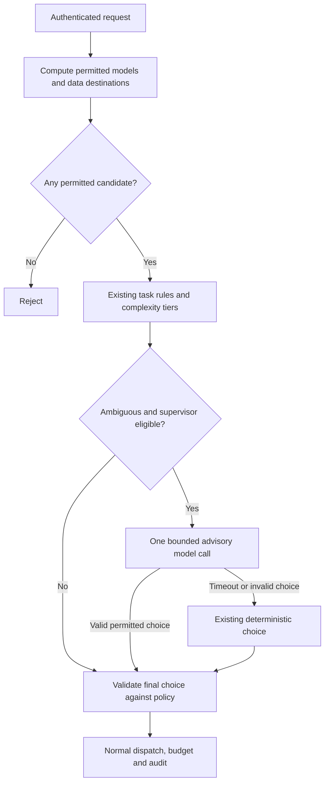

# ADR-0033: Optional model supervisor inside policy bounds

Status: proposed; not implemented. Date: 2026-09-26.

## Problem and recommendation

A model can classify ambiguous requests better than keywords alone, but adds a
provider call, latency, cost and another destination for input data. Grob should
evaluate an optional advisory supervisor for those requests. It should not replace
deterministic routing or become the authority that grants access to models, tools,
credentials or security exceptions.

The first experiment should select one approved logical model for a request.
Task decomposition, autonomous worker loops and cross-agent memory are outside
this proposal. They are unnecessary for deciding where to route a request.

## Optional routing improvement

The supervisor is a possible improvement to evaluate, not a prerequisite for
using Grob. The proposed operating modes below are design requirements, not
configuration options available in the current binary.

| Proposed mode | Behavior |
|---|---|
| Disabled (default) | Use existing routing, with no supervisor call, credential requirement or added inference cost. |
| Observe | Keep the existing route; compare an advisory choice on an explicitly enabled, bounded sample of eligible requests. |
| Assist | Let a validated advisory choice influence routing only for explicitly enabled task families and permitted candidates. |

Observation still sends data to the supervisor and incurs inference cost. It
requires the same destination restrictions, data minimization and limits as
assisted routing. Promote it to assisted routing only after a measured benefit
in quality, cost or latency, without weakening security requirements.

Operators control activation and can return to disabled mode. On supervisor
failure, Grob uses its existing route subject to the same policy checks. The
supervisor cannot enable itself, change configuration or expand permissions;
improvement does not imply autonomous retraining or self-modification.

## What already exists

| Need | Current mechanism | Reuse decision |
|---|---|---|
| Known task, prompt rule or reasoning request | `routing::classify::Router::route` | Keep as the fast path. |
| Complexity selection | Declarative tiers, heuristic classifier and `grob_hint` | Benchmark against these before adding model inference. |
| Provider failover | Model mappings, health checks, circuit breakers and adaptive scores | Keep; the supervisor selects no URL or credential. |
| Parallel candidates | Fan-out `fastest`, `weighted`, `best_quality` | Separate from routing; fan-out increases calls and data recipients. |
| Candidate evaluation | Existing fan-out judge | Reuse the concept, not its direct provider-call path. |
| Permissions and limits | Identity scopes, provider resolution and per-provider policy/budget gates | Enforce independently on every auxiliary and final call. |
| Service credential injection | Dedicated HTTP service gateway | Keep deterministic and separate; no supervisor in this path. |

See the [routing reference](../reference/routing.md) and
[fan-out limits](../reference/fan-out.md#cost-tracking). Existing fan-out accounting
uses winner usage for participant estimates and omits judge usage. The judge
resolves its provider directly. Before reusing this path for an orchestration
feature, unify its authorization, policy, residency and spend handling with normal
dispatch and prove them with end-to-end tests. This proposal does not claim that
prerequisite is complete.

## Proposed boundary

1. Build the candidate set from authenticated tenant/agent scope, declared model
   capabilities, operator-approved destinations and current policy. Region labels
   are operator assertions, not proof of residency. Grob's current `global` region
   exception must not silently enter a strict-residency candidate set.
2. Apply the same destination restrictions to the supervisor itself. If it cannot
   receive the request's data, skip it. DLP masking is not proof that an entire
   request is safe to export.
3. Send only the minimum approved task context and candidate identifiers. Do not
   send keys, credentials, arbitrary tool schemas, tool-call authority or the
   complete conversation by default. Treat task text and tool results as untrusted
   content even after masking.
4. Accept only a bounded structured choice of one identifier from the supplied
   candidate set. Unknown fields, invented models, extra tool calls and malformed
   output cannot alter policy. Recheck the chosen candidate before dispatch.
5. Security classifications supplied by trusted policy remain a lower bound on
   protection. A model may recommend stricter treatment; it cannot lower the
   classification, disable DLP/HIT, extend a budget or authorize another region.
6. Keep one immutable configuration/policy snapshot throughout the choice. Apply
   the same restrictions to retries and fallbacks. No eligible candidate means
   rejection, not an unrestricted direct-provider fallback.
7. Bound the auxiliary call by a separate concurrency limit, deadline, input/output
   size and spend allowance. Disable recursive supervision and all tools on it.
   Count its observed usage once, including failures/cancellation where available.
8. On outage, invalid output or exhausted supervisor allowance, use the existing
   deterministic route only if it passes the same policy. Keep the default mode
   disabled; enabling it must not be necessary for Grob startup.

Use a reason code, candidate-set digest, selected logical model, policy revision,
latency and cost in diagnostics. Do not retain raw classified prompts or hidden
reasoning. A cache, if later justified, must include tenant, policy revision and
candidate set so an old recommendation cannot outlive its permissions.

## When it is useful

| Situation | Preferred mechanism |
|---|---|
| Known code/test/search task or stable keyword rules | Existing deterministic routing. |
| Sensitive task requiring local or approved-region processing | Policy first; use a supervisor only inside the same allowed boundary. |
| Ambiguous intent with a meaningful cheap/strong-model tradeoff | Evaluate the optional supervisor. |
| Provider outage or rate limit | Existing failover; another LLM does not repair availability. |
| Choose the best of several already generated answers | Optional fan-out judge after its call path is qualified. |
| Rotate credentials or grant tool permissions | Existing administrative/policy controls. |

## Smallest experiment and acceptance gates

Start with offline replay on a consented or synthetic, labeled task corpus.
Compare three choices on a held-out split: current rules/tiers, a small local
classifier, and an approved LLM supervisor. Use existing providers and test
harnesses; do not add an orchestration framework or custom cryptography.

Measure quality per task family, total cost including supervision and retries,
p50/p95 latency, failure rate and routing stability during tool-call turns. Before
the experiment, agree the required quality and latency thresholds. Retain the
supervisor only if it gives a measured benefit within those limits; an extra LLM
call that merely repeats the existing choice should be removed.

Required negative cases: prompt injection asking for a forbidden model; spoofed
tenant/security labels; forbidden judge provider; policy reload mid-request;
supervisor timeout, malformed JSON or oversized output; recursive self-routing;
budget exhaustion; a safe primary whose fallback is forbidden; no eligible model;
and strict-residency input offered to a noncompliant supervisor. Every forbidden
destination must observe zero requests. Mock-server proofs precede opt-in live
evaluation; neither demonstrates production savings by itself.

## External references and interpretation

- [Anthropic: Building effective agents](https://www.anthropic.com/engineering/building-effective-agents)
  describes routing with either model-based or conventional classification and
  favors simple composable workflows. This supports evaluating a bounded routing
  step before introducing autonomous workers.
- [RouteLLM](https://github.com/lm-sys/RouteLLM) provides learned routing and an
  evaluation framework. It is a comparison baseline; importing its Python serving
  stack into this Rust proxy is not required to test the idea.
- [OWASP: Excessive Agency](https://genai.owasp.org/llmrisk/llm062025-excessive-agency/)
  motivates narrow functionality and permissions. The hard-policy/advisory-model
  separation above is a design inference from that guidance, not an OWASP
  certification or a guarantee against prompt injection.
