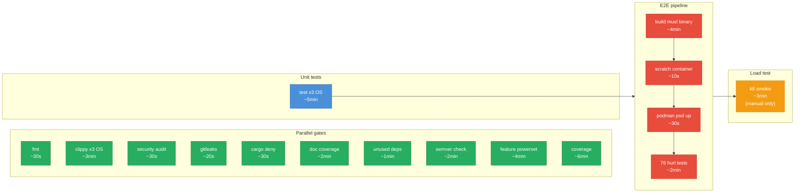
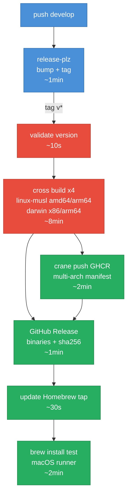

# CI/CD Pipeline PERT

## CI Workflow (push to develop / PR)

**Critical path**: test (5min) -> musl build (4min) -> container (10s) -> pod (30s) -> 76 tests (2min) = ~12min

## Release Workflow (tag push)

**Critical path**: validate (10s) -> cross build (8min) -> GHCR + Release -> Homebrew = ~14min

## Timing Summary

| Stage | Wall time | Trigger |
|-------|-----------|---------|
| CI parallel gates | ~6min | Every push |
| CI critical path (test -> e2e) | ~12min | Every push |
| Load test | +3min | Manual only |
| Release (tag -> GHCR + binaries) | ~14min | feat/fix commits on src/ |
