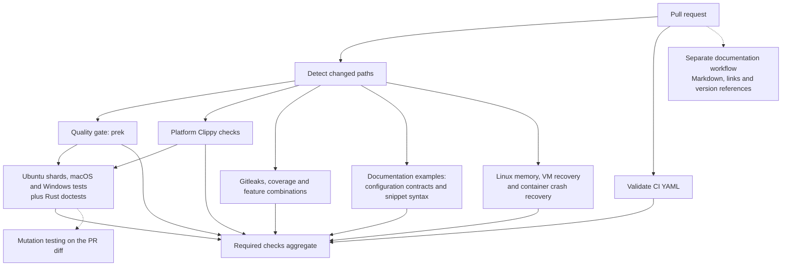
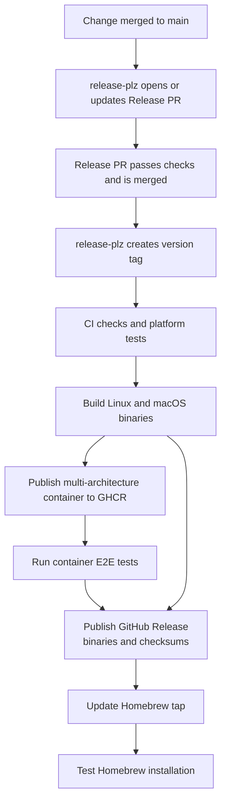

# CI/CD workflow overview

The workflow files define the exact triggers, conditions and dependencies:
[CI](../../.github/workflows/ci.yml),
[release-plz](../../.github/workflows/release-plz.yml),
[hardening](../../.github/workflows/hardening.yml), and
[documentation checks](../../.github/workflows/docs-lint.yml).
These diagrams explain the main paths; job duration depends on runner capacity,
caches and the changed files.

## Pull request checks

The change detector selects the Rust, CI and E2E work needed for a change.
Formatting, Clippy, dependency checks and rustdoc checks are grouped by
[prek](../../prek.toml); they are not separate parallel jobs. Documentation changes
outside `src/` skip most Rust jobs. The `src/**` filter also matches module READMEs,
so editing those files triggers Rust checks.

```mermaid
flowchart TB
    pr["Pull request"] --> changes["Detect changed paths"]
    changes --> quality["Quality gate: prek"]
    changes --> clippy["Platform Clippy checks"]
    quality --> tests["Ubuntu shards, macOS and Windows tests<br/>plus Rust doctests"]
    clippy --> tests
    changes --> other["Gitleaks, coverage and feature combinations"]
    changes --> examples["Documentation examples:<br/>configuration contracts and snippet syntax"]
    changes --> hardening["Linux memory, VM recovery<br/>and container crash recovery"]
    pr --> yaml["Validate CI YAML"]
    quality --> required["Required checks aggregate"]
    clippy --> required
    tests --> required
    other --> required
    examples --> required
    hardening --> required
    yaml --> required
    tests -.-> mutations["Mutation testing on the PR diff"]
    pr -.-> docs["Separate documentation workflow<br/>Markdown, links and version references"]
```

The `required` job in `ci.yml` lists the checks aggregated for branch protection.
Other workflows, including CodeQL and Semgrep, also report results. A green
aggregate does not mean every optional or path-filtered job ran. The aggregate
currently accepts skipped jobs and most cancelled jobs; hardening cancellation
is blocking when that job runs. The documentation-example job must succeed when
documentation, implementation or CI paths select it; a skipped or cancelled
selected job blocks the aggregate. Its Rust test filters also fail when empty.

The main container E2E job is not a pull request gate: its event condition
selects pushes or eligible manual runs. Container crash recovery is a separate
hardening check that can run on pull requests.

## Main and release publication

A releasable change on `main` opens or updates a release pull request. A tag is
created after that release PR is merged, not directly after every feature PR.

```mermaid
flowchart TB
    main["Change merged to main"] --> releasePR["release-plz opens or updates Release PR"]
    releasePR --> merge["Release PR passes checks and is merged"]
    merge --> tag["release-plz creates version tag"]
    tag --> tests["CI checks and platform tests"]
    tests --> build["Build Linux and macOS binaries"]
    build --> container["Publish multi-architecture container to GHCR"]
    container --> e2e["Run container E2E tests"]
    e2e --> release["Publish GitHub Release<br/>binaries and checksums"]
    build --> release
    release --> homebrew["Update Homebrew tap"]
    homebrew --> brewTest["Test Homebrew installation"]
```

Eligible pushes to `main` also run the build, container and E2E path. GitHub
Release publication and Homebrew updates require a version tag. The release job
checks that the tag matches `Cargo.toml` before publishing assets.

## Manual load tests and skipped jobs

The workflow exposes `run_load` for the k6 smoke test and `skip_e2e` for E2E
selection. Both jobs still depend on earlier jobs succeeding. In the current
workflow, `build` and `container` only run for push events; a manual run can
therefore skip E2E and load tests because their container dependency was skipped.
Check the job results before treating a manual run as load-test evidence.

For actual durations and executed checks, use the workflow run's Pipeline
Summary and job logs. Avoid comparing runs with different path selections or
cache states as if they measured the same workload.
