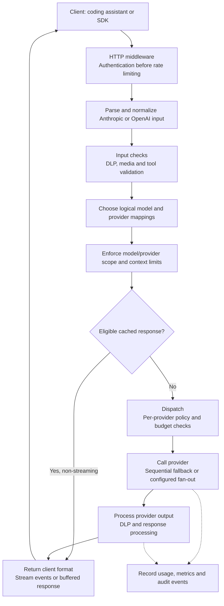

# Grob Architecture

Grob is a multi-provider LLM routing proxy written in Rust. It accepts requests in both Anthropic and OpenAI formats, routes them to the best available provider, and returns responses with streaming support.

## Request flow

This overview follows the normal LLM request path. Security features apply when
enabled in the configuration; credential-gateway requests use their own
[restricted forwarding path](../how-to/route-service-credentials.md).

Input checks run before routing and any upstream request. Output checks run on
the provider response, including stream chunks; they are a separate pass. The
cache and fan-out paths have different accounting behavior, described in the
[caching](../reference/caching.md) and [fan-out](../reference/fan-out.md)
references. The [routing reference](../reference/routing.md) defines rule order
and model overrides.

## Module layout

| Module | Path | Purpose |
|--------|------|---------|
| `server` | `src/server/mod.rs` | Axum HTTP server, middleware stack, request handlers |
| `server::openai_compat` | `src/server/openai_compat/` | OpenAI `/v1/chat/completions` request/response translation |
| `server::oauth_handlers` | `src/server/oauth_handlers.rs` | OAuth authorization, token exchange, callback endpoints |
| `server::fan_out` | `src/server/fan_out.rs` | Parallel multi-provider dispatch (fan-out strategy) |
| `providers` | `src/providers/mod.rs` | Provider trait and registry |
| `providers::anthropic_compatible` | `src/providers/anthropic_compatible.rs` | Anthropic API provider (native passthrough) |
| `providers::openai` | `src/providers/openai/mod.rs` | OpenAI API provider (with streaming, transform, types submodules) |
| `providers::gemini` | `src/providers/gemini/mod.rs` | Gemini API provider (with retry, transform, types submodules) |
| `providers::streaming` | `src/providers/streaming.rs` | SSE stream parsing and forwarding |
| `providers::registry` | `src/providers/registry.rs` | Provider registration and model lookup |
| `routing` | `src/routing/mod.rs` | Routing parent: request classification + nature-inspired primitives (ADR-0018) |
| `routing::classify` | `src/routing/classify/mod.rs` | Request classification engine (regex prompt rules, tier matching, auto-map, complexity classifier). Previously at `src/router/` — merged here as part of the vertical-slice foundation (audit #12). |
| `routing::circuit_breaker` | `src/routing/circuit_breaker.rs` | RE-1a passive per-endpoint circuit breaker (Caddy-style `max_fails` + `fail_duration`) |
| `routing::health_check` | `src/routing/health_check.rs` | RE-1b active per-provider health probe (Caddy-style `health_uri`/`health_interval`/`health_timeout`/`health_status`). AND-gated with RE-1a in `ProviderRegistry::is_endpoint_healthy` |
| `cli` | `src/cli/mod.rs` | Config structs (AppConfig, ServerConfig, etc.) and CLI parsing |
| `preset` | `src/preset/mod.rs` | Preset management (list, apply, export, sync, validate) |
| `auth` | `src/auth/mod.rs` | Auth module aggregator |
| `auth::oauth` | `src/auth/oauth.rs` | OAuth client with PKCE |
| `auth::token_store` | `src/auth/token_store.rs` | Persistent OAuth token storage (encrypted files) |
| `auth::jwt` | `src/auth/jwt.rs` | JWT validation and JWKS refresh |
| `features::token_pricing` | `src/features/token_pricing/mod.rs` | Token counting and dynamic pricing table |
| `features::token_pricing::spend` | `src/features/token_pricing/spend.rs` | Persistent monthly spend tracking and budget enforcement |
| `features::dlp` | `src/features/dlp/mod.rs` | DLP engine (secret scanning, PII detection) |
| `features::dlp::builtins` | `src/features/dlp/builtins.rs` | 25 builtin secret detection rules |
| `features::dlp::pii` | `src/features/dlp/pii.rs` | PII scanner (names, emails, phones) |
| `features::dlp::canary` | `src/features/dlp/canary.rs` | Canary token injection and detection |
| `features::dlp::dfa` | `src/features/dlp/dfa.rs` | Aho-Corasick DFA for stream scanning |
| `features::dlp::stream` | `src/features/dlp/stream.rs` | DLP-aware SSE stream wrapper |
| `features::dlp::session` | `src/features/dlp/session.rs` | Per-session DLP state management |
| `features::tap` | `src/features/tap/mod.rs` | Webhook tap (event emission to external URL) |
| `security` | `src/security/mod.rs` | Security module aggregator |
| `security::circuit_breaker` | `src/security/circuit_breaker.rs` | Circuit breaker pattern (Closed/Open/HalfOpen) |
| `security::rate_limit` | `src/security/rate_limit.rs` | Token-bucket rate limiter per tenant/IP |
| `security::headers` | `src/security/headers.rs` | OWASP security response headers |
| `security::audit_log` | `src/security/audit_log.rs` | Signed audit log with ECDSA P-256 |
| `security::cache` | `src/security/cache.rs` | Response caching (moka) |
| `security::provider_scorer` | `src/security/provider_scorer.rs` | Adaptive provider scoring (EWMA latency, success rate) |
| `security::risk` | `src/security/risk.rs` | Risk assessment for EU AI Act controls |
| `storage` | `src/storage/mod.rs` | Persistent storage layer: atomic files, JSONL journals (GrobStore) |
| `storage::migrate` | `src/storage/migrate.rs` | Storage migrations |
| `models` | `src/models/mod.rs` | Anthropic request/response types, route types |
| `features::mcp` | `src/features/mcp/mod.rs` | MCP tool matrix: tool catalogue, scoring, calibration |
| `features::mcp::bench` | `src/features/mcp/bench/` | Continuous tool-calling benchmark engine |
| `features::mcp::server` | `src/features/mcp/server/` | JSON-RPC MCP endpoints |
| `features::policies` | `src/features/policies/` | Unified policy engine (glob-based match rules, per-tenant/zone/compliance overrides) |
| `features::policies::hit` | `src/features/policies/hit.rs` | HIT Gateway — per-action human authorization for tool_use |
| `features::log_export::encryption` | `src/features/log_export/encryption.rs` | Age envelope encryption for multi-recipient audit export |
| `features::harness` | `src/features/harness/mod.rs` | Record & replay sandwich testing harness (tape, mock backend, driver) |
| `cache` | `src/cache/mod.rs` | Response cache (moka) for deterministic requests |
| `shared` | `src/shared/mod.rs` | Cross-cutting modules shared across vertical slices (audit #35) |
| `shared::message_tracing` | `src/shared/message_tracing/mod.rs` | Request/response trace logging (JSONL with rotation) |
| `shared::pid` | `src/shared/pid.rs` | PID file management for daemon mode |
| `shared::instance` | `src/shared/instance.rs` | Multi-instance coordination |
| `shared::net` | `src/shared/net.rs` | Network binding with SO_REUSEPORT for zero-downtime upgrades |
| `shared::otel` | `src/shared/otel.rs` | OpenTelemetry subscriber bootstrap |
| `shared::acme` | `src/shared/acme.rs` | Automatic TLS certificate provisioning via ACME |
| `commands` | `src/commands/mod.rs` | CLI command implementations (start, stop, exec, doctor, etc.) |
| `pricing` | `src/pricing.rs` | Static model pricing table (leaf module at crate root — intentionally breaks the cycle between `providers::streaming` and `features::token_pricing`) |

## Key design decisions

**Config is static at runtime.** The server loads TOML config on startup. The `/api/config/reload` endpoint atomically swaps the in-memory config (`ReloadableState`: router, provider registry, model index) without restarting the process. In-flight requests continue using the old config snapshot via `Arc` cloning.

**Provider abstraction.** All providers implement the same trait. The proxy normalizes everything to Anthropic's internal message format, then translates outbound to each provider's wire format.

**Fallback with circuit breakers.** Each model maps to one or more providers ordered by priority. If the highest-priority provider fails, the request automatically falls through to the next. Circuit breakers (5 failures = open, 30s timeout, 3 successes to close) prevent repeated calls to degraded providers.

**Streaming-first.** Both SSE streaming and buffered responses are supported. DLP scanning operates on stream chunks using Aho-Corasick automata, so no full-response buffering is needed.

**Persistent state in atomic files.** Credentials use authenticated encryption
and atomic publication; monthly spend uses append-only journals with batched
fsync. These have different durability boundaries. See the
[storage reference](../reference/storage.md) for layout, key custody and recovery.

**Security middleware stack.** All security features are toggled via the `[security]` TOML section: `rate_limit_rps`, `rate_limit_burst`, `max_body_size`, `security_headers`, `circuit_breaker`, `audit_dir`. Set `enabled = false` to disable the entire security layer. Each request gets a `X-Request-Id` (UUID v4 if not provided) for tracing across logs.

**jemalloc allocator.** The default `jemalloc` feature selects jemalloc on
non-MSVC targets. Throughput depends on the workload; measure it on the target host.

**Pass-through provider mode.** Providers with `pass_through = true` accept any model name not explicitly listed in `[[models]]`, forwarding it as-is to the upstream API. This enables wildcard model routing for providers like OpenRouter.

**Fan-out strategy.** Models can use `strategy = "fan_out"` to dispatch requests to multiple providers in parallel, selecting the fastest response, the best quality (via a judge model), or a weighted composite. Fan-out runs alongside the standard fallback strategy.

**MCP tool matrix.** A static TOML catalogue of tool-calling capabilities per provider, augmented by a continuous bench engine that tests tool reliability. The router can calibrate tool lists per request based on the selected provider's scores.
