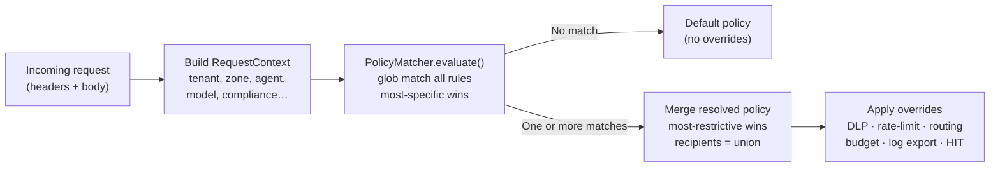
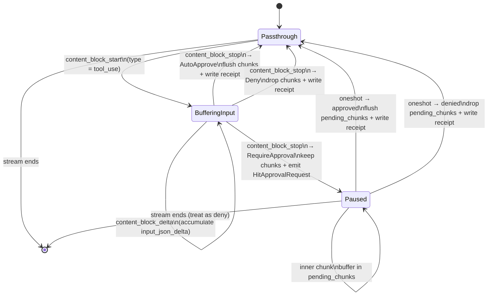
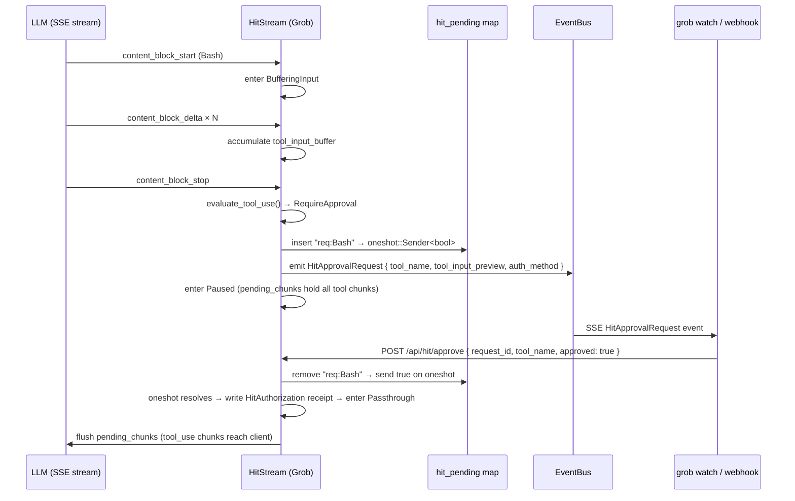
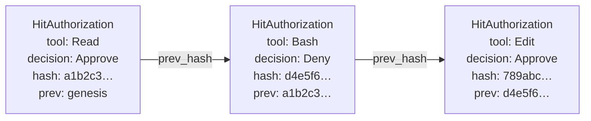

# How the policy engine and HIT Gateway work

This document explains the architecture and data flow of two related features:
the **policy engine** (per-tenant rule evaluation) and the **HIT Gateway**
(per-action human authorization for `tool_use` blocks).

---

## Policy engine

The policy engine evaluates each request against a list of `[[policies]]` rules
before it enters the dispatch pipeline. A single match can activate multiple
effects: DLP overrides, rate limit overrides, routing overrides, budget limits,
log export recipients, and HIT authorization rules.

### Match → resolve → enforce



**Specificity** is the number of non-None fields in `MatchRules`. When two
policies match the same request, the one with more specific rules wins. For
conflicting numeric limits (rate, budget) the more restrictive value wins; for
log export recipients the union is taken.

**Reload behaviour**: `[[policies]]` are part of `ReloadableState`. Changes take
effect immediately on `POST /api/config/reload` without a server restart.

---

## HIT Gateway — state machine

When the resolved policy includes a `[policies.hit]` section, the SSE response
stream is wrapped in a `HitStream` adapter. The adapter buffers every
`tool_use` content block until `content_block_stop` (to obtain the complete
tool input), then makes a policy decision.



> **Why buffer until `content_block_stop`?**
> Deny rules can match on tool arguments (e.g. `Bash(rm -rf*)`). The argument
> arrives in `content_block_delta` chunks *after* `content_block_start`. By
> deferring the decision to `content_block_stop`, the full input is available
> for pattern matching and for computing the `tool_input_hash` in the audit receipt.

---

## HIT approval flow



### Auth method variants

| `auth_method` | Behaviour |
|---------------|-----------|
| `prompt` (default) | Single approver via `POST /api/hit/approve` or grob watch TUI |
| `machine_key` | Auto-approve immediately — no human interaction. Logs receipt. |
| `multisig` | M-of-N distinct signers, each posting to `/api/hit/approve` with `signer` field. Uses `MultiSigCollector`. |
| `quorum` | N votes tallied with configurable majority/unanimous strategy. |
| `webhook` | Emits event with `webhook_url`; relay task POSTs to external system. External calls `/api/hit/approve`. |
| `yubikey` | FIDO2 YubiKey hardware key — **not yet implemented** (WI-8b). Falls back to `prompt` with a warning. |

---

## Audit receipt chain

Every tool_use decision (approve, deny, auto-approve) produces a
`HitAuthorization` record written to the audit log:



Each `HitAuthorization` is SHA-256 hash-chained to the previous one in the
same request session. Tampering with any entry breaks the chain, which is
verified by `HitAuthorization::verify()`. Receipts are appended to the audit
log as `AuditEvent::HitApproval` entries, which are themselves hash-chained
and ECDSA-signed.

---

## Configuration reference

```toml
[[policies]]
name = "dev-standard"

[policies.match]
agent    = "claude-code*"
user     = "clement@*"

[policies.hit]
auto_approve      = ["Read", "Glob", "Grep", "LSP"]
require_approval  = ["Edit", "Write", "Bash"]
deny              = ["Bash(rm -rf*)", "Bash(curl*|sh)", "Write(*.env)"]
auth_method       = "prompt"     # prompt | machine_key | multisig | quorum | webhook | yubikey | openbao
flag_patterns     = ["run this command", "curl.*\\| sh", "sudo "]

# multisig: require 2 distinct humans
required_signatures = 2

# quorum: majority of 3 LLM voters
[policies.hit.quorum]
strategy           = "majority"
min_voters         = 3
required_approvals = 2
on_failure         = "escalate_human"
```

See `docs/reference/` for the full config field reference.

---

## See also

- [ADR-0007 — Federated multi-enterprise HIT authorization](../decisions/0007-hit-federated-multisig.md) — architecture decision for multisig and cross-enterprise approval chains
- [ADR-0006 — Policy engine, encrypted audit, HIT Gateway](../decisions/0006-policy-engine-encrypted-audit-hit-gateway.md) — < 10 µs per-request overhead rationale and HIT design decisions
