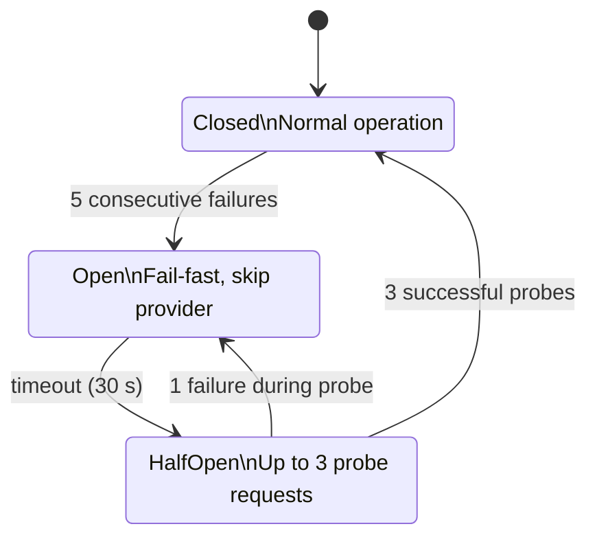

# Security Model

This document explains the security architecture of Grob, the threat assumptions it operates under, and how each security feature works.

## Threat model

Grob is a local or shared proxy that handles sensitive data: API keys, OAuth tokens, and LLM conversation content. The primary threats are:

1. **Credential leakage**: API keys or OAuth tokens exposed in logs, config responses, or error messages
2. **Unauthorized access**: Unauthenticated requests reaching LLM providers via the proxy
3. **Cost abuse**: Runaway spend from misconfigured routing or compromised clients
4. **Data exfiltration**: Sensitive data (secrets, PII) leaving the organization via LLM prompts or responses
5. **Provider cascading failure**: One degraded provider causing request queuing and timeout cascades

## Defense layers

### Authentication

Grob supports three authentication modes for incoming requests:

- **None** (default for local use): No authentication required. Suitable when Grob binds to localhost only.
- **API key**: Set `[auth] mode = "api_key"` and an administrative `api_key = "secret:grob-admin"`. Agents use scoped virtual keys. Clients send `Authorization: Bearer <token>` or `x-api-key: <token>`; key comparison uses constant-time equality. The legacy `[server] api_key` is also accepted.
- **JWT**: Set `[auth] mode = "jwt"` and `[auth.jwt]` to validate tokens through JWKS or a shared HMAC secret. Tenant JWTs do not grant administrative access.

Health (`/health`, `/live`, `/ready`), metrics (`/metrics`), and the two OAuth callback paths are exempt from the main API-key/JWT check. Other OAuth endpoints require administrative access. See [Authentication Reference](../reference/authentication.md) for exact paths, setup examples and the JWT cache limitation.

`/metrics` carries spend, budget, and tenant labels, so it can be gated independently with its own bearer token via `[metrics] bearer_token` / `bearer_token_file` (constant-time comparison, `401` on mismatch). It stays public when unset; the health probes always stay public. See [how-to/deploy](../how-to/deploy.md#protect-metrics-with-a-bearer-token).

### Rate limiting

Rate limiting is disabled by default (`rate_limit_rps = 0`). For shared deployments, configure both `rate_limit_rps` and `rate_limit_burst` under `[security]`. The token bucket is keyed by authenticated tenant, with source-IP fallback; client-based limits are also available. Exceeding the limit returns HTTP 429 with `Retry-After`. See [rate-limit configuration](../reference/configuration.md#security).

### Circuit breakers

Per-provider circuit breaker pattern prevents cascading failures:

| State | Behavior |
|-------|----------|
| Closed | Normal operation. Requests pass through. |
| Open | After 5 consecutive failures. Requests fail-fast for 30 seconds. |
| HalfOpen | After timeout. Allows up to 3 probe requests. 3 successes = Closed, 1 failure = Open. |

When a circuit breaker opens, requests skip that provider and fall through to the next priority mapping. This ensures one degraded provider does not block the entire request pipeline.

### DLP (Data Loss Prevention)

The binary must include the `dlp` feature and the configuration must set `[dlp] enabled = true`. Scanning can cover requests and responses:

- **Secrets**: built-in rules for API tokens, private keys and database connection strings; custom rules can extend them.
- **Financial PII**: credit cards and IBANs by default; BIC/SWIFT scanning is optional.
- **Names**: configured names, or optional heuristic name detection.
- **Canary replacements**: selected rules can substitute traceable fake values.
- **URL exfiltration and prompt injection**: separate opt-in detectors.

Email addresses and telephone numbers are not general built-in PII detectors. DLP is pattern-based and cannot guarantee that all sensitive data is removed. Streaming scanners keep bounded chunks instead of requiring a complete response. See [DLP Reference](../reference/dlp.md) for actions and limits.

### Credential protection

- Provider API keys and legacy `server.api_key` support `$ENV_VAR` at config load. `auth.api_key` supports live `secret:<name>` references; it does not expand dollar-prefixed environment names. See [Manage Secrets](../how-to/manage-secrets.md) for encrypted storage and rotation.
- The `/api/config` endpoint redacts API keys in responses
- OAuth tokens are encrypted at rest; files use `0600` permissions on Unix and owner-only permissions on Windows.
- Sensitive data (OAuth codes, PKCE verifiers, token responses, upstream bodies) is excluded from debug logs
- API key comparison uses constant-time equality to prevent timing side-channels
- Gemini, OAuth token exchanges, device authorization, and credential probes require HTTPS outside loopback (`localhost`, loopback IPv4, or `::1`). These clients refuse redirects; configure the final endpoint URL instead of a redirecting alias.
- Gemini API keys use the sensitive `x-goog-api-key` header, not URL query parameters.

See the [September 2026 code-scanning review](security-alert-triage.md) for the findings, trust boundaries, and regression checks behind these transport restrictions.

### Security headers

When enabled, Grob applies OWASP-recommended security headers to all responses:

- `X-Content-Type-Options: nosniff`
- `X-Frame-Options: DENY`
- `Strict-Transport-Security` (when behind TLS)
- `X-Request-Id` for request tracing

### Request size limits

`max_body_size` defaults to `0`, which disables the body limit so large agent contexts are not rejected before parsing. Set a positive value to reject oversized payloads with HTTP `413` before parsing in multi-tenant or public deployments.

### Budget enforcement

Monthly spend limits at three levels (model > provider > global) prevent cost overruns. When a limit is reached, requests return HTTP 402. OAuth/subscription providers are tracked at $0 cost.

### Audit logging

With the `compliance` feature and `security.audit_dir` configured, Grob writes signed, hash-chained audit entries. ECDSA P-256 is the default; Ed25519 and HMAC-SHA256 are alternatives. These records support investigation and evidence collection, but do not provide regulatory certification. Protect the signing key and log storage separately. See [Audit logging](../reference/security.md#audit-logging).

## TLS

Grob supports native TLS via rustls (no OpenSSL dependency):

- **Manual**: Provide certificate and key files via `[server.tls]`; requires a binary built with the `tls` feature.
- **ACME**: Configure `[server.tls.acme]` for automatic Let's Encrypt certificates; requires the `acme` feature.

For most deployments, running behind a reverse proxy (nginx, Caddy, Traefik) that handles TLS is recommended over native TLS.

## Adaptive provider scoring

When `adaptive_scoring = true`, Grob ranks providers by a composite score combining success rate, latency (EWMA-smoothed), and recency. Scores decay over time to prevent stale rankings from masking degraded providers. The scoring window, decay rate, and latency alpha are configurable. Scores currently live in memory and reset on restart. The parsed `scoring_persist` option is not wired to persistence.

This feature is opt-in: sorting by `priority / adaptive_factor` can change the configured order, including between different priority values. It may therefore change cost as well as latency.

## Response cache

When `[cache] enabled = true`, Grob caches responses for deterministic requests (temperature=0). Cache keys are computed from the tenant ID, model, messages, and tools. The cache uses moka (concurrent, TTL-evicting) with configurable capacity and TTL. Cache hits bypass the entire provider pipeline, returning instantly with `x-grob-cache: hit`. Only non-streaming requests are cached.

## EU AI Act controls

The `[compliance]` section enables controls that support EU AI Act evidence needs:

- **Transparency headers**: `X-AI-Provider`, `X-AI-Model`, `X-AI-Generated`, `X-Grob-Audit-Id` on every response (Article 50)
- **Audit enrichment**: Model name and token counts recorded in audit entries (Article 12)
- **Risk classification**: Requests scored by DLP trigger count, block status, injection detection, and PII presence (Article 14)
- **Escalation**: High-risk events dispatched to a configured webhook for human review

The `eu-ai-act` preset enables the related controls in one command.

## Network binding

By default, Grob binds to `[::1]:13456` (IPv6 localhost only). Plain `grob run` defaults to `::` (all interfaces); the shipped container explicitly passes `--host 0.0.0.0`. The bind address should match the deployment scenario:

- **Local workstation**: `::1` (default) -- only local processes can connect (IPv6). Use `127.0.0.1` for IPv4-only environments.
- **Container**: `0.0.0.0` -- accessible from outside the container (use network policies)
- **Shared server**: Use `api_key` or JWT authentication when binding to non-localhost addresses
