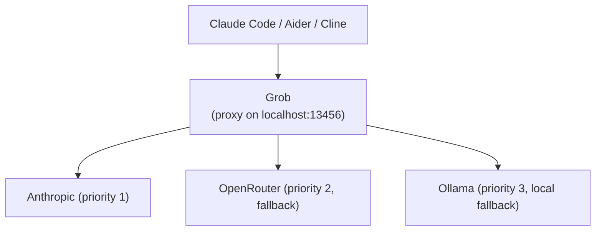

# Grob Documentation

Grob is a multi-provider LLM routing proxy. It sits between your AI coding assistant (Claude Code, Aider, Cline, etc.) and your LLM providers, routing requests with automatic failover, format translation, and spend tracking.

## Who is this for?

- **Developers** using AI coding assistants who want to route through multiple providers with automatic fallback
- **Teams** that need spend tracking, budget enforcement, and DLP scanning on LLM traffic
- **Operators** deploying LLM proxies in containers or on shared infrastructure

## How it works

Grob accepts requests in both Anthropic and OpenAI API formats, normalizes them, classifies by task type (thinking, web search, background, default), and dispatches to the best available provider. If one provider fails, the next in the priority chain is tried automatically.

## Quick navigation

### Getting started

| Level | Document | Time |
|-------|----------|------|
| First contact | [Getting Started](tutorials/getting-started.md) | 10 min |
| Quick reference | [Quick Start](QUICKSTART.md) | 2 min |

### Task-oriented guides

| Task | Guide |
|------|-------|
| Set up a provider | [Provider Setup](PROVIDERS.md) |
| Configure OAuth | [OAuth Setup](OAUTH_SETUP.md) |
| Configure DLP | [How to Configure DLP](how-to/dlp.md) |
| Configure options | [How to Configure Grob](how-to/configure.md) |
| Deploy in a container | [How to Deploy Grob](how-to/deploy.md) |
| Fix common problems | [Troubleshooting](TROUBLESHOOTING.md) |
| Contribute | [How to Contribute](how-to/contribute.md) |

### Reference

| Topic | Document |
|-------|----------|
| All config options | [Configuration Reference](CONFIGURATION.md) |
| DLP engine | [DLP Reference](reference/dlp.md) |
| OWASP LLM Top 10 | [OWASP Coverage](reference/owasp-llm-top10.md) |
| CLI commands | [CLI Reference](reference/cli.md) |
| Provider internals | [Provider Reference](reference/providers.md) |
| API compatibility | [API Compatibility Reference](reference/api-compatibility.md) |
| API endpoints | [OpenAPI Spec](openapi.yaml) |
| OpenAI compatibility | [OpenAI Compatibility](openai-compatibility.md) |
| Responses API | [Responses API Compatibility](responses-api-compatibility.md) |
| Error codes | [Error Reference](reference/errors.md) |

### Understanding Grob

| Topic | Document |
|-------|----------|
| Architecture | [Architecture Overview](ARCHITECTURE.md) |
| Security model | [Security Model](explanation/security.md) |
| Design philosophy | [Design Principles](design-principles.md) |
| Gemini specifics | [Gemini Integration](gemini-integration.md) |
| Architecture decisions | [ADRs](decisions/) |
| Design doc template | [Design Doc Template](design/000-template.md) |

## Version

Current release: **v0.17.0** -- see [CHANGELOG](../CHANGELOG.md) for history.
