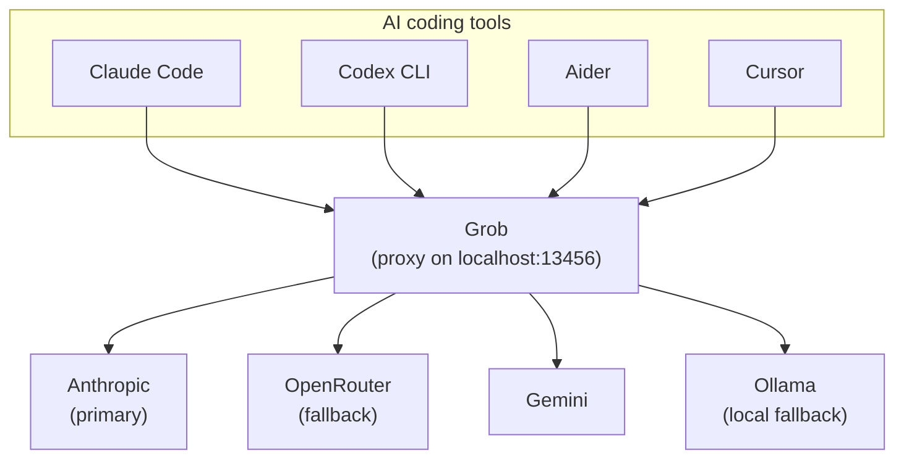

# Grob Documentation

Grob forwards requests from your AI tools to configured model providers. It can
switch providers after a failure, translate API formats, track spending, and
screen traffic for sensitive data.

## Start with your goal

| I want to… | Start here |
|------------|------------|
| Run an AI coding tool through Grob | [Getting started](tutorials/getting-started.md) |
| Call Grob from my own application | [Python](examples/sdk-python.md) or [Node.js](examples/sdk-node.md) examples |
| Choose models, add a fallback or set a budget | [Configure Grob](how-to/configure.md) |
| Replace credentials without changing my agent | [Manage secrets](how-to/manage-secrets.md#replace-credentials-without-changing-the-agent) |
| Run Grob for a team | [Deploy](how-to/deploy.md), then [authentication](reference/authentication.md) |
| Understand or fix an error | [Troubleshooting](how-to/troubleshooting.md) |

The tutorial is enough for a first local run. The references below explain
individual options; architecture decisions record design history and proposals.
An ADR marked **proposed**, including the optional model supervisor, does not
mean its configuration is available in the current binary.

## Who is this for?

- **Developers** using AI coding assistants who want to route through multiple providers with automatic fallback
- **Teams** that need spend tracking, budget enforcement, and DLP scanning on LLM traffic
- **Operators** deploying LLM proxies in containers or on shared infrastructure

## How it works

```mermaid
flowchart TB
    subgraph clients["AI coding tools"]
        claude["Claude Code"]
        codex["Codex CLI"]
        aider["Aider"]
        cursor["Cursor"]
    end

    claude --> grob["Grob<br/>(proxy on localhost:13456)"]
    codex --> grob
    aider --> grob
    cursor --> grob

    grob --> anthropic["Anthropic<br/>(primary)"]
    grob --> openrouter["OpenRouter<br/>(fallback)"]
    grob --> gemini["Gemini"]
    grob --> ollama["Ollama<br/>(local fallback)"]
```

Grob accepts Anthropic and OpenAI API formats and selects a configured route.
If that route has several provider mappings, it can try the next one after a
failure. The diagram shows an example setup; providers and fallbacks must be
configured before Grob can use them.

### Terms used in these guides

| Term | Meaning in Grob |
|------|-----------------|
| Provider | A service that runs models, such as Anthropic, OpenAI or a local Ollama server. |
| Logical model | A name used by your client, such as `default`; Grob maps it to a provider's actual model. |
| Mapping / fallback | A provider and actual model to try, followed by alternatives if configured. |
| Preset | A ready-made configuration you can inspect and apply. |
| DLP | Data Loss Prevention: scanning that can redact or block detected sensitive content. |
| Tenant / virtual key | An identity and its Grob access key, used to apply separate permissions and limits. |
| Upstream credential | The provider's API key or OAuth token; separate from the key your client uses to access Grob. |

## Quick navigation

### Getting started

| Level | Document | Time |
|-------|----------|------|
| First contact | [Getting Started](tutorials/getting-started.md) | 10 min |
| Quick reference | [Getting Started, "In a hurry"](tutorials/getting-started.md#in-a-hurry) | 2 min |

### Task-oriented guides

| Task | Guide |
|------|-------|
| Set up a provider | [Provider Setup](how-to/providers.md) |
| Configure OAuth | [OAuth Setup](how-to/oauth-setup.md) |
| Configure DLP | [How to Configure DLP](how-to/dlp.md) |
| Configure options | [How to Configure Grob](how-to/configure.md) |
| Keep replicas consistent (HA) | [Multi-Replica Consistency](how-to/multi-replica-consistency.md) |
| Deploy in a container | [How to Deploy Grob](how-to/deploy.md) |
| Call Grob from Python | [Python SDK Examples](examples/sdk-python.md) |
| Call Grob from Node.js | [Node SDK Examples](examples/sdk-node.md) |
| Manage upstream secrets | [Manage Secrets](how-to/manage-secrets.md) |
| Protect credential keys and lifecycle | [Credential storage](how-to/protect-credential-storage.md) |
| Lock sensitive memory and verify limits | [Harden memory](how-to/harden-memory.md) |
| Inject service credentials with optional Vault | [Route service credentials](how-to/route-service-credentials.md) |
| Tune routing from traces | [Auto-tune Routing](how-to/auto-tune-routing.md) |
| Set up the fuzzy response cache | [Configure the SimHash Cache](how-to/configure-simhash-cache.md) |
| Override complexity per call | [Use grob_hint](how-to/use-grob-hint.md) |
| Verify and debug OAuth flows | [OAuth Testing](how-to/oauth-testing.md) |
| Verify hedge cancellation billing (pre-work for ADR-0020) | [Verify Hedge Cancellation Billing](how-to/verify-hedge-cancellation-billing.md) |
| Fix common problems | [Troubleshooting](how-to/troubleshooting.md) |
| Contribute | [How to Contribute](how-to/contribute.md) |
| Maintain dependencies | [Run Renovate](how-to/maintain-dependencies.md) |

### Reference

| Topic | Document |
|-------|----------|
| All config options | [Configuration Reference](reference/configuration.md) |
| CLI commands | [CLI Reference](reference/cli.md) |
| DLP engine | [DLP Reference](reference/dlp.md) |
| Routing engine | [Routing Reference](reference/routing.md) |
| Authentication | [Authentication Reference](reference/authentication.md) |
| Caching | [Caching Reference](reference/caching.md) |
| Fan-out racing | [Fan-out Reference](reference/fan-out.md) |
| Security middleware | [Security Reference](reference/security.md) |
| Storage backend | [Storage Reference](reference/storage.md) |
| Observability | [Observability Reference](reference/observability.md) |
| Operations | [Operations Reference](reference/operations.md) |
| Setup wizard | [Setup Wizard Reference](reference/setup-wizard.md) |
| Feature matrix | [Feature Matrix](reference/features.md) |
| Benchmarks | [Benchmarks](reference/benchmarks.md) |
| OWASP LLM Top 10 | [OWASP Coverage](reference/owasp-llm-top10.md) |
| Provider internals | [Provider Reference](reference/providers.md) |
| Protocol fidelity (what survives translation) | [Protocol Fidelity Matrix](reference/protocol-fidelity.md) |
| Agent conformance (what is *tested* to survive) | [Agent Conformance](reference/conformance.md) |
| API compatibility | [API Compatibility Reference](reference/api-compatibility.md) |
| API endpoints | [OpenAPI Spec](openapi.yaml) |
| HIT risk scoring | [HIT Risk Scoring](reference/hit-scoring.md) |
| Indirect prompt injection | [DLP Indirect Injection Detection](reference/dlp-indirect-injection.md) |
| Error codes | [Error Reference](reference/errors.md) |

### Understanding Grob

| Topic | Document |
|-------|----------|
| Architecture | [Architecture Overview](explanation/architecture.md) |
| Slice manifest (per-module charters) | [Slice Manifest](slices/MANIFEST.md) |
| Security model | [Security Model](explanation/security.md) |
| Policy engine | [Policy Engine](explanation/policies.md) |
| Design philosophy | [Design Principles](explanation/design-principles.md) |
| Why dependency updates are staged | [Dependency upgrades](explanation/dependency-upgrades.md) |
| Gemini specifics | [Gemini Integration](how-to/gemini-integration.md) |
| OTLP exemplars (why not yet) | [OTLP Exemplars](explanation/otlp-exemplars.md) |
| Design doc template | [Design Doc Template](design/000-template.md) |
| Design docs in flight | [`design/`](design/) |

### Architecture decisions (ADRs)

Browse design decisions and proposals

| ADR | Title |
|-----|-------|
| [0001](decisions/0001-static-config-no-hot-reload.md) | Explicit API reload — no filesystem hot-reload |
| [0002](decisions/0002-custom-oauth-no-crate.md) | Custom OAuth implementation — no oauth2 crate |
| [0003](decisions/0003-regex-routing-engine.md) | Regex-based routing engine |
| [0004](decisions/0004-persistent-spend-tracking.md) | Persistent spend tracking in redb (GrobStore) (superseded) |
| [0005](decisions/0005-anthropic-native-provider-trait.md) | Anthropic-native provider trait abstraction |
| [0006](decisions/0006-policy-engine-encrypted-audit-hit-gateway.md) | Unified Policy Engine, Encrypted Audit Export, and HIT Gateway |
| [0007](decisions/0007-openai-compat-dual-surface.md) | OpenAI Compatibility — Dual Surface (Chat Completions + Responses) |
| [0008](decisions/0008-wizard-lifecycle.md) | Wizard Lifecycle Architecture |
| [0009](decisions/0009-pledge-structural-tool-filtering.md) | Pledge — Structural Tool Filtering for LLM Payloads |
| [0010](decisions/0010-universal-tool-layer.md) | Universal Tool Layer — Injection, Aliasing, Capability Gating |
| [0011](decisions/0011-control-engine-mcp-tools.md) | ControlEngine Generic + MCP-Tools-First Configuration Surface |
| [0012](decisions/0012-no-unikernel.md) | No Unikernel — Prefer Secure-by-Design + seccomp + scratch Image |
| [0013](decisions/0013-storage-files-no-redb.md) | Storage on Atomic Files + Append-Only Journal — No redb |
| [0014](decisions/0014-mesh-wireguard-kiss.md) | Mesh Networking — WireGuard KISS, With a Second Profile for Scale (proposed) |
| [0015](decisions/0015-indirect-prompt-injection-coverage.md) | Indirect Prompt Injection Coverage — Scan Responses and `tool_result` Blocks |
| [0016](decisions/0016-decision-tokens-transparent-routing.md) | Decision Tokens — Transparent Agent Routing |
| [0017](decisions/0017-sokolsky-log-backend.md) | Sokolsky LogBackend — Cross-Plane Audit with N-of-N Signatures |
| [0018](decisions/0018-nature-inspired-routing.md) | Nature-Inspired Routing — Topology vs Policy, Caddy-KISS, Biomimetic Primitives |
| [0019](decisions/0019-ema-stigmergy-endpoint-scoring.md) | Adaptive Provider Scoring v1 — Provider-Level Score Before `[[endpoints]]` |
| [0020](decisions/0020-hedged-requests.md) | Hedged Requests — Tail-Latency Reduction via Speculative Duplication (proposed) |
| [0022](decisions/0022-declarative-endpoints-policies-schema.md) | Declarative `[[endpoints]]` and `[[policies]]` — Routing Schema Rebuild (proposed) |
| [0023](decisions/0023-preset-naming-and-composition.md) | Preset Naming and Composition Strategy (proposed) |
| [0024](decisions/0024-preset-as-compliance-template.md) | Preset-as-Compliance-Template — Packaged Compliance Decisions (proposed) |
| [0025](decisions/0025-rpc-mutation-transactionality.md) | RPC Mutation Transactionality and In-Flight Visibility (proposed) |
| [0026](decisions/0026-model-name-canonicalization-policy.md) | Model Name Canonicalization Policy (proposed) |
| [0027](decisions/0027-adopt-system-oauth-credentials.md) | Adopt OAuth Credentials from Co-installed CLIs (proposed) |
| [0028](decisions/0028-open-core-boundary.md) | Open-Core Boundary — AGPL Core vs Commercial Modules (superseded) |
| [0029](decisions/0029-relicense-core-apache.md) | Relicense Grob Core to Apache-2.0 |
| [0030](decisions/0030-fail-closed-dependency-contract.md) | Required integrations fail closed when unavailable |
| [0031](decisions/0031-optional-vault-credential-routing.md) | Credential routing with optional Vault and local recovery |
| [0032](decisions/0032-credential-gateway-hardening.md) | Credential gateway protocol, transport and key custody hardening |
| [0033](decisions/0033-advisory-model-supervisor.md) | Optional model supervisor inside policy bounds (proposed) |

### Examples

| Topic | File |
|-------|------|
| Default config | [`examples/default.toml`](examples/default.toml) |
| Anthropic Claude Max via OAuth | [`examples/claude-max-oauth.toml`](examples/claude-max-oauth.toml) |
| ChatGPT Codex via OAuth (Plus/Pro) | [`examples/chatgpt-codex-oauth.toml`](examples/chatgpt-codex-oauth.toml) |
| DeepSeek-only setup | [`examples/deepseek.toml`](examples/deepseek.toml) |
| Multi-provider mix with fallbacks | [`examples/mixed.toml`](examples/mixed.toml) |
| Model declaration patterns | [`examples/models.toml`](examples/models.toml) |
| Local Ollama backend | [`examples/ollama.toml`](examples/ollama.toml) |

### Diagrams

| Topic | File |
|-------|------|
| CI/CD release flow (PERT) | [`diagrams/ci-cd-pert.md`](diagrams/ci-cd-pert.md) |
| Request/dispatch architecture | [`explanation/architecture.md`](explanation/architecture.md) |
| DLP scanning pipeline | [`reference/dlp.md`](reference/dlp.md) |

## Monitoring

Grob exposes Prometheus metrics at `/metrics`. A Grafana dashboard ships in
[grafana-dashboard.json](grafana-dashboard.json).

## Version

These docs describe the repository revision you are reading. See
[`Cargo.toml`](../Cargo.toml) for its version and the [CHANGELOG](../CHANGELOG.md)
for release history. When using an older binary, read the docs at its release tag.
