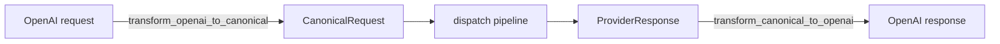
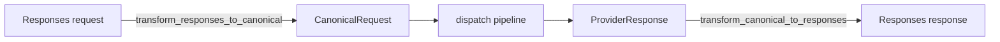

# API Compatibility Reference

Grob exposes three HTTP endpoints that accept different request formats. All requests are translated to a canonical internal format (Anthropic Messages API), routed through the same provider/fallback logic, then translated back to the caller's expected format.

## Endpoint Summary

| Endpoint | Format | Typical clients | Source module |
|----------|--------|-----------------|---------------|
| `POST /v1/messages` | Anthropic Messages API (native) | Claude Code, Anthropic SDK | `src/server/handlers.rs` |
| `POST /v1/chat/completions` | OpenAI Chat Completions API | Aider, Cline, Continue, Cursor | `src/server/openai_compat/` |
| `POST /v1/responses` | OpenAI Responses API | Codex CLI, OpenAI SDK (Responses mode) | `src/server/responses_compat/` |

---

## 1. Anthropic Messages API (`/v1/messages`)

The native endpoint. Requests pass through the dispatch pipeline with no format translation.

### Request format

```json
{
  "model": "default",
  "system": "You are a helpful assistant.",
  "messages": [
    {"role": "user", "content": "Hello!"}
  ],
  "max_tokens": 1024,
  "stream": false
}
```

### Key fields

| Field | Type | Required | Description |
|-------|------|----------|-------------|
| `model` | string | yes | Grob model name or upstream model ID |
| `system` | string or array | no | System prompt (text or content blocks) |
| `messages` | array | yes | Conversation messages with `role` and `content` |
| `max_tokens` | integer | yes | Maximum output tokens |
| `stream` | boolean | no | Enable SSE streaming (default: false) |
| `temperature` | float | no | Sampling temperature |
| `top_p` | float | no | Nucleus sampling threshold |
| `top_k` | integer | no | Top-k sampling |
| `stop_sequences` | array | no | Custom stop sequences |
| `tools` | array | no | Tool definitions for function calling |
| `tool_choice` | object | no | Tool selection strategy |
| `metadata` | object | no | Request metadata (e.g., `user_id`) |

### Response format

```json
{
  "id": "msg_xxx",
  "type": "message",
  "role": "assistant",
  "content": [
    {"type": "text", "text": "Hello! How can I help?"}
  ],
  "model": "claude-sonnet-4-20250514",
  "stop_reason": "end_turn",
  "usage": {
    "input_tokens": 20,
    "output_tokens": 10,
    "cache_creation_input_tokens": 0,
    "cache_read_input_tokens": 0
  }
}
```

### Streaming

SSE events follow the Anthropic streaming protocol:

| Event | Description |
|-------|-------------|
| `message_start` | Response metadata and usage |
| `content_block_start` | New content block (text, tool_use, thinking) |
| `content_block_delta` | Incremental content (text_delta, input_json_delta, thinking_delta) |
| `content_block_stop` | Content block complete |
| `message_delta` | Stop reason and final usage |
| `message_stop` | Stream complete |
| `ping` | Keep-alive |

---

## 2. OpenAI Chat Completions API (`/v1/chat/completions`)

### Translation pipeline



For streaming, the `AnthropicToOpenAIStream` state machine converts Anthropic SSE events into OpenAI `chat.completion.chunk` events on the fly.

### Supported features

- Text message completions
- System messages (extracted to Anthropic `system` field)
- Multi-turn conversations
- Image inputs (base64 data URIs and plain URLs)
- Streaming (`stream: true`) with SSE
- Tool/function calling (translated to Anthropic `tool_use` format)
- `tool_choice` (`auto`, `none`, `required`, named function)
- Parameters: `temperature`, `top_p`, `stop`, `max_tokens`
- Extension fields preserved for lossless roundtrip: `response_format`, `reasoning_effort`, `seed`, `frequency_penalty`, `presence_penalty`, `parallel_tool_calls`, `user`, `logprobs`, `top_logprobs`, `service_tier`

### Limitations

| Feature | Status |
|---------|--------|
| `n` (multiple completions) | Not supported (always 1 choice) |
| `response_format` (JSON mode) | Captured but not enforced by Anthropic backend |
| `logprobs` | Captured but not returned by Anthropic backend |
| Thinking blocks | Silently dropped in response translation |
| Image blocks in response | Silently dropped in response translation |

### Request format

```json
{
  "model": "default",
  "messages": [
    {"role": "system", "content": "You are a helpful assistant."},
    {"role": "user", "content": "Hello!"}
  ],
  "max_tokens": 1024
}
```

### Message role mapping

| OpenAI role | Canonical handling |
|-------------|-------------------|
| `system` | Extracted into top-level `system` field (not sent as a message) |
| `user` | Mapped to canonical user message; multi-part content preserved |
| `assistant` | Mapped to canonical assistant message; `tool_calls` become `tool_use` blocks |
| `tool` | Mapped to `tool_result` block inside a user message; consecutive tool results are merged |

### Image handling

Images in user messages are supported via the `image_url` content part type.

**Base64 data URIs** (`data:image/jpeg;base64,...`) are parsed into Anthropic `base64` image source blocks. Supported media types: `image/jpeg`, `image/png`, `image/gif`, `image/webp`. Unknown types default to `image/png`.

**Plain URLs** (`https://...`) are preserved as `url`-type image sources.

### Tool calling

#### Request (OpenAI to canonical)

| OpenAI field | Canonical field |
|--------------|-----------------|
| `tools[].function.name` | `tools[].name` |
| `tools[].function.description` | `tools[].description` |
| `tools[].function.parameters` | `tools[].input_schema` |

`tool_choice` mapping:

| OpenAI value | Canonical value |
|--------------|-----------------|
| `"auto"` | `{"type": "auto"}` |
| `"none"` | `{"type": "auto"}` |
| `"required"` | `{"type": "any"}` |
| `{"type": "function", "function": {"name": "X"}}` | `{"type": "tool", "name": "X"}` |

#### Response (canonical to OpenAI)

| Canonical field | OpenAI field |
|-----------------|--------------|
| `tool_use.id` | `tool_calls[].id` |
| `tool_use.name` | `tool_calls[].function.name` |
| `tool_use.input` (JSON) | `tool_calls[].function.arguments` (serialized string) |

The `finish_reason` is set to `"tool_calls"` when the stop reason is `tool_use`.

#### Assistant messages with tool calls (roundtrip)

When an assistant message contains both `content` text and `tool_calls`, the canonical form uses a block-based message with separate `text` and `tool_use` content blocks. Tool call arguments are parsed from JSON strings; malformed arguments fall back to an empty JSON object.

### Response format

```json
{
  "id": "chatcmpl-xxx",
  "object": "chat.completion",
  "created": 1234567890,
  "model": "default",
  "choices": [
    {
      "index": 0,
      "message": {
        "role": "assistant",
        "content": "Hello! How can I help you today?"
      },
      "finish_reason": "stop"
    }
  ],
  "usage": {
    "prompt_tokens": 20,
    "completion_tokens": 10,
    "total_tokens": 30
  }
}
```

### Finish reason mapping

| Anthropic `stop_reason` | OpenAI `finish_reason` |
|--------------------------|------------------------|
| `end_turn` | `stop` |
| `max_tokens` | `length` |
| `stop_sequence` | `stop` |
| `tool_use` | `tool_calls` |

### Streaming

Each Anthropic SSE event is translated to an OpenAI `chat.completion.chunk` event:

| Anthropic event | OpenAI chunk | Content |
|-----------------|-------------|---------|
| `message_start` | First chunk | `delta.role = "assistant"` |
| `content_block_start` (type: `tool_use`) | Tool call start | `delta.tool_calls[].id`, `.type`, `.function.name` |
| `content_block_delta` (type: `text_delta`) | Text chunk | `delta.content = "..."` |
| `content_block_delta` (type: `input_json_delta`) | Tool args fragment | `delta.tool_calls[].function.arguments = "..."` |
| `message_delta` | Final chunk | `finish_reason` set |
| `message_stop` | Stream end | `data: [DONE]` |

Other Anthropic events (e.g. `content_block_stop`, `ping`) are silently skipped.

### Extension fields

These fields are captured from the OpenAI request and stored in `RequestExtensions` for lossless provider roundtrips. They are forwarded to providers that support them (e.g., OpenAI, Gemini) but may be ignored by Anthropic backends.

| Field | Type | Description |
|-------|------|-------------|
| `response_format` | object | Structured output format (`json_schema`, `json_object`) |
| `reasoning_effort` | string | Reasoning effort hint for o-series models |
| `seed` | integer | Deterministic sampling seed |
| `frequency_penalty` | float | Penalises tokens by existing frequency |
| `presence_penalty` | float | Penalises tokens that have already appeared |
| `parallel_tool_calls` | boolean | Allow multiple tool calls in one turn |
| `user` | string | End-user identifier for abuse monitoring |
| `logprobs` | boolean | Enable per-token log-probabilities |
| `top_logprobs` | integer | Number of most-likely tokens to return log-probs for |
| `service_tier` | string | Requested service tier |

---

## 3. OpenAI Responses API (`/v1/responses`)

### Translation pipeline



For streaming, the `AnthropicToResponsesStream` state machine converts Anthropic SSE events into Responses API named-event SSE events on the fly.

### Supported features

- Text and structured input (plain string or typed items)
- System instructions (extracted to canonical `system` field)
- Multi-turn conversations with function call history
- Streaming (`stream: true`) with named SSE events
- Tool/function calling (flat format, no nested `function` wrapper)
- Reasoning configuration (`reasoning.effort`)
- Parameters: `temperature`, `top_p`, `max_output_tokens`
- Extension fields preserved for lossless roundtrip: `parallel_tool_calls`, `service_tier`

### Limitations

| Feature | Status |
|---------|--------|
| `previous_response_id` | Accepted but ignored (grob is stateless) |
| `store` | Accepted but ignored |
| Thinking blocks in response | Silently dropped |
| Image blocks in response | Silently dropped |
| Image inputs | Not supported (only `input_text` content parts) |
| `tool_choice` | Not supported (always auto) |

### Request format

#### Simple text input

```json
{
  "model": "default",
  "instructions": "You are a helpful assistant.",
  "input": "Hello!",
  "stream": false
}
```

#### Structured input with function calls

```json
{
  "model": "default",
  "input": [
    {
      "type": "message",
      "role": "user",
      "content": "List the files"
    },
    {
      "type": "function_call",
      "id": "call_1",
      "name": "ls",
      "arguments": "{\"path\":\".\"}"
    },
    {
      "type": "function_call_output",
      "call_id": "call_1",
      "output": "file1.rs\nfile2.rs"
    }
  ],
  "tools": [
    {
      "type": "function",
      "name": "ls",
      "description": "List directory contents",
      "parameters": {
        "type": "object",
        "properties": {
          "path": { "type": "string" }
        }
      }
    }
  ]
}
```

### Input item types

| Item type | Description | Canonical mapping |
|-----------|-------------|-------------------|
| `message` | Conversation message with `role` and `content` | User/assistant message; system role merged into `system` field |
| `function_call` | Tool invocation by the assistant | Assistant message with `tool_use` content block |
| `function_call_output` | Result of a function call | User message with `tool_result` content block |

### Tool calling

#### Request (Responses to canonical)

Responses API tools use a flat format (no nested `function` wrapper). Grob also accepts the Chat Completions nested format as a fallback.

**Flat format (preferred):**

| Responses field | Canonical field |
|-----------------|-----------------|
| `tools[].name` | `tools[].name` |
| `tools[].description` | `tools[].description` |
| `tools[].parameters` | `tools[].input_schema` |

**Nested fallback:**

| Responses field | Canonical field |
|-----------------|-----------------|
| `tools[].function.name` | `tools[].name` |
| `tools[].function.description` | `tools[].description` |
| `tools[].function.parameters` | `tools[].input_schema` |

#### Response (canonical to Responses)

| Canonical field | Responses field |
|-----------------|-----------------|
| `tool_use.id` | `function_call.call_id` |
| `tool_use.name` | `function_call.name` |
| `tool_use.input` (JSON) | `function_call.arguments` (serialized string) |

Text and function call outputs are interleaved in the order they appear.

#### Function call merging (request)

Consecutive `function_call` items from the same assistant turn are merged into a single assistant message with multiple `tool_use` blocks. Consecutive `function_call_output` items are merged into a single user message with multiple `tool_result` blocks.

### Response format

```json
{
  "id": "resp_abc123",
  "object": "response",
  "created_at": 1234567890,
  "model": "default",
  "output": [
    {
      "type": "message",
      "id": "msg_xyz",
      "role": "assistant",
      "content": [
        {
          "type": "output_text",
          "text": "Hello! How can I help you today?"
        }
      ],
      "status": "completed"
    }
  ],
  "status": "completed",
  "usage": {
    "input_tokens": 20,
    "output_tokens": 10,
    "total_tokens": 30
  }
}
```

### Output item types

| Type | Description |
|------|-------------|
| `message` | Text response from the assistant |
| `function_call` | Tool invocation requested by the model |

### Streaming

Named SSE events (unlike Chat Completions which uses `data: {...}` format):

| Anthropic event | Responses event | Description |
|-----------------|----------------|-------------|
| `message_start` | `response.created` | Stream begins, response with `status: "in_progress"` |
| `content_block_start` (text) | `response.output_item.added` + `response.content_part.added` | New text message item |
| `content_block_start` (tool_use) | `response.output_item.added` | New function call item |
| `content_block_delta` (text_delta) | `response.output_text.delta` | Text content fragment |
| `content_block_delta` (input_json_delta) | `response.function_call_arguments.delta` | Function arguments fragment |
| `content_block_stop` (text) | `response.content_part.done` + `response.output_item.done` | Text item completed |
| `content_block_stop` (tool_use) | `response.function_call_arguments.done` + `response.output_item.done` | Function call completed |
| `message_stop` | `response.completed` + `data: [DONE]` | Stream ends |

Other Anthropic events (e.g. `ping`, `message_delta`) are silently skipped.

### Reasoning configuration

```json
{
  "model": "default",
  "input": "Solve this problem step by step.",
  "reasoning": {
    "effort": "high"
  }
}
```

| Effort value | Description |
|-------------|-------------|
| `"low"` | Minimal reasoning |
| `"medium"` | Balanced reasoning |
| `"high"` | Deep reasoning (extended thinking) |

---

## Cross-endpoint comparison

| Aspect | `/v1/messages` | `/v1/chat/completions` | `/v1/responses` |
|--------|----------------|------------------------|-----------------|
| Input format | `messages` array | `messages` array with roles | `input` (string or items) + `instructions` |
| System prompt | Top-level `system` field | `system` role message | `instructions` field |
| Tool format | `name`, `description`, `input_schema` | Nested `function` wrapper | Flat (name, description, parameters) |
| Token limit field | `max_tokens` | `max_tokens` | `max_output_tokens` |
| Streaming format | Anthropic SSE events | `data: {...}` chunks | Named `event: ...` SSE events |
| Response structure | `content[]` blocks | `choices[].message` | `output[]` items |
| Image support | Base64 and URL | Base64 data URI and URL | Not supported |
| Tool choice | `auto`, `any`, `tool` | `auto`, `none`, `required`, named | Not supported (always auto) |
| Format translation | None (canonical) | Bidirectional | Bidirectional |

## Error format

All three endpoints return errors in OpenAI format when accessed via an OpenAI-compatible endpoint, or Anthropic format when accessed via `/v1/messages`:

**OpenAI format** (used by `/v1/chat/completions` and `/v1/responses`):
```json
{
  "error": {
    "message": "Error description",
    "type": "error_type",
    "code": "error_code"
  }
}
```

**Anthropic format** (used by `/v1/messages`):
```json
{
  "type": "error",
  "error": {
    "type": "error_type",
    "message": "Error description"
  }
}
```

## Source files

| File | Purpose |
|------|---------|
| `src/server/handlers.rs` | HTTP handlers for all three endpoints |
| `src/server/openai_compat/mod.rs` | OpenAI Chat Completions module root |
| `src/server/openai_compat/types.rs` | Chat Completions request/response structs |
| `src/server/openai_compat/transform.rs` | Chat Completions bidirectional conversion |
| `src/server/openai_compat/stream.rs` | Chat Completions SSE translator |
| `src/server/responses_compat/mod.rs` | Responses API module root |
| `src/server/responses_compat/types.rs` | Responses API request/response structs |
| `src/server/responses_compat/transform.rs` | Responses API bidirectional conversion |
| `src/server/responses_compat/stream.rs` | Responses API named-event SSE translator |
