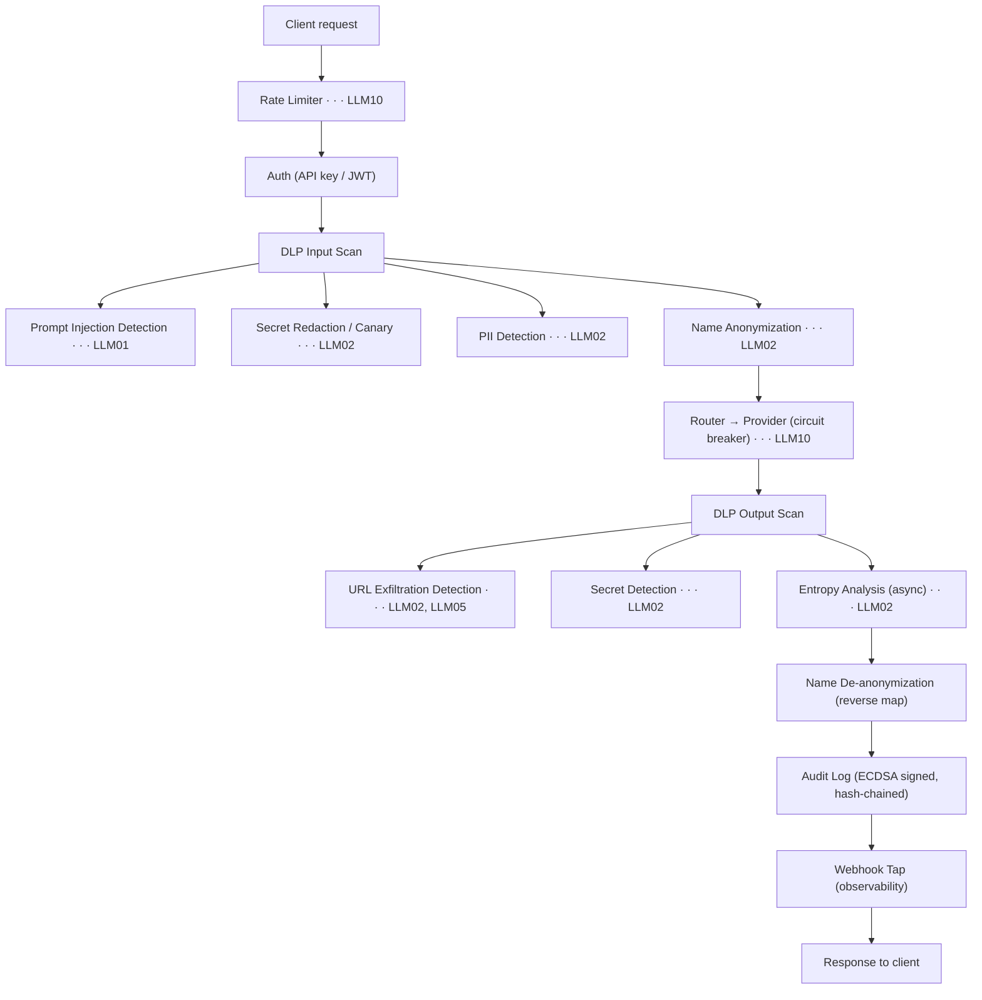

# OWASP Top 10 for LLM Applications — Grob Coverage

This document maps each risk from the [OWASP Top 10 for LLM Applications 2025](https://owasp.org/www-project-top-10-for-large-language-model-applications/) to the Grob features that mitigate it.

## Coverage matrix

| # | Risk | Grob mitigation | Default | Config |
|---|------|-----------------|---------|--------|
| LLM01 | Prompt Injection | Prompt injection detector (28 languages, obfuscation resistance) | Opt-in | `[dlp.prompt_injection]` |
| LLM02 | Sensitive Information Disclosure | Secret scanner, PII detector, name anonymizer, canary tokens, entropy analysis | Enabled | `[dlp]` |
| LLM02 | Data Exfiltration via URLs | URL exfiltration detector (Markdown images/links, data URIs, base64 paths) | Opt-in | `[dlp.url_exfil]` |
| LLM04 | Data and Model Poisoning | Bidirectional DLP scanning (input + output) | Enabled | `dlp.scan_input`, `dlp.scan_output` |
| LLM05 | Improper Output Handling | DLP output scan blocks dangerous content before it reaches the client | Enabled | `dlp.scan_output` |
| LLM10 | Unbounded Consumption | Rate limiting, circuit breakers, monthly budget enforcement | Enabled | `[security]`, `[budget]` |
| — | Audit and compliance | Signed audit log (ECDSA/HMAC), risk classification, transparency headers | Opt-in | `[compliance]` |

### Out of scope

| # | Risk | Why |
|---|------|-----|
| LLM03 | Supply Chain | Model and plugin selection is a provider-side concern |
| LLM06 | Excessive Agency | Tool execution happens in the client (Claude Code, Forge, Codex), not in the proxy |
| LLM07 | System Prompt Leakage | The system prompt originates in the client; Grob routes it as-is |
| LLM08 | Vector and Embedding Weaknesses | Grob has no RAG or embedding pipeline |
| LLM09 | Misinformation | Factual accuracy cannot be assessed at the proxy layer |

## LLM01 — Prompt Injection

**Risk.** Adversarial prompts override LLM instructions, extract secrets, or trigger unintended behavior. Indirect injection embeds malicious instructions in external content (files, web pages) consumed by the LLM.

**Grob mitigation.** The `[dlp.prompt_injection]` module scans every inbound message for injection patterns before the request reaches the provider.

Detection covers:

- **28 language patterns** — English, French, German, Spanish, Chinese, Japanese, Korean, Arabic, and 20 more. All languages are scanned by default.
- **Obfuscation resistance** — leet speak (`1gn0r3`), Unicode homoglyphs (Cyrillic/Greek → Latin normalization), zero-width character stripping, base64-wrapped payloads.
- **Custom patterns** — user-defined regex rules supplement the built-in set.

Actions: `log`, `redact`, or `block`. Blocked requests return HTTP 400 with a DLP error.

```toml
[dlp.prompt_injection]
enabled = true
action = "block"          # log | redact | block
languages = ["all"]       # or ["en", "fr", "zh", ...]
```

## LLM02 — Sensitive Information Disclosure

**Risk.** The LLM leaks API keys, PII, or confidential data through its responses. Attackers craft prompts to extract training data or context-window content.

Grob applies five independent detection layers on both input and output:

### 1. Secret detection (`[dlp]`)

30+ built-in rules detect GitHub tokens, AWS keys, OpenAI/Anthropic keys, JWTs, PEM private keys, database connection strings, Stripe keys, and more. Custom rules support any regex pattern with a prefix gate for fast rejection.

Actions per rule: `canary`, `redact`, or `log`.

- **Canary** (default) replaces the secret with a syntactically valid fake that preserves format and length. Example: `ghp_realtoken123...` → `ghp_~CANARY0000000001...`. If the canary appears downstream, the leak source is identifiable.
- **Redact** replaces with `[REDACTED]`.

```toml
[dlp]
enabled = true
scan_input = true
scan_output = true

[[dlp.secrets]]
name = "internal_token"
prefix = "itk_"
pattern = "itk_[A-Za-z0-9]{40}"
action = "canary"
```

### 2. PII detection (`[dlp.pii]`)

Detects credit card numbers (Luhn checksum validated), IBAN numbers (ISO 13616 mod-97 validated), and BIC/SWIFT codes. Mathematical validation eliminates false positives from random digit sequences.

```toml
[dlp.pii]
credit_cards = true
iban = true
bic = false            # Disabled by default (higher false positive rate)
action = "redact"
```

### 3. Name anonymization (`[[dlp.names]]`)

Replaces configured names with consistent pseudonyms (`Person_XXXX`). The mapping is reversed on the response path so the client sees original names while the LLM never does.

```toml
[[dlp.names]]
term = "Thales"
action = "pseudonym"   # pseudonym | redact | log
```

### 4. URL exfiltration detection (`[dlp.url_exfil]`)

Detects data exfiltration attempts where the LLM embeds secrets in outbound URLs (Markdown images, links, data URIs). This mitigates attacks like [EchoLeak (CVE-2025-32711)](https://nvd.nist.gov/vuln/detail/CVE-2025-32711) where injected prompts instruct the model to encode context data into image URLs.

Detection signals:

| Signal | Example |
|--------|---------|
| Markdown image with external URL | `` |
| Data URI | `` |
| Base64 segment in URL path | `https://evil.com/exfil/c2VjcmV0Cg==` |
| Long query parameter (>200 bytes) | Encoded data appended to query string |

Domain whitelisting and blacklisting with three match modes (`exact`, `suffix`, `glob`) allow fine-tuning.

```toml
[dlp.url_exfil]
enabled = true
action = "block"
whitelist_domains = ["cdn.example.com", "*.internal.corp"]
domain_match_mode = "suffix"
```

### 5. Entropy analysis (`[dlp.entropy]`)

Catches unknown secret types that no pattern rule covers. Uses a Sequential Probability Ratio Test (SPRT) on Shannon entropy to flag high-entropy strings (>5.5 bits/byte by default). Runs asynchronously to avoid blocking the response path.

```toml
[dlp.entropy]
enabled = true
action = "log"
```

## LLM04 — Data and Model Poisoning

**Risk.** Malicious content injected into training data or context corrupts model behavior. In a proxy context, this means poisoned prompts or tool results flowing through unchecked.

**Grob mitigation.** Bidirectional DLP scanning (`scan_input = true` + `scan_output = true`) ensures content is sanitized in both directions. The prompt injection detector (LLM01) catches adversarial payloads before they reach the model.

## LLM05 — Improper Output Handling

**Risk.** LLM output containing malicious content (URLs, scripts, encoded payloads) is passed to downstream systems without validation.

**Grob mitigation.** Output-side DLP scanning detects secrets, PII, suspicious URLs, and high-entropy strings in every response before it reaches the client. The URL exfiltration detector specifically targets response-side data leakage vectors.

## LLM10 — Unbounded Consumption

**Risk.** Excessive resource usage through repeated or expensive requests. Attackers exploit unrestricted access to run up costs or degrade service.

Grob applies three layers of consumption control:

### Rate limiting (`[security]`)

Token-bucket rate limiter per tenant (API key, JWT `tenant_id`, or IP). Returns HTTP 429 with `Retry-After` header when exceeded.

```toml
[security]
rate_limit_rps = 100     # Sustained rate
rate_limit_burst = 200   # Burst capacity
```

### Circuit breaker (`[security]`)

Per-provider circuit breaker prevents cascading failures. After 5 consecutive errors, the provider is bypassed for 30 seconds. Requests automatically fall through to the next priority mapping.

### Budget enforcement (`[budget]`)

Monthly spend limits at three levels: per-model, per-provider, and global. When a limit is reached, requests return HTTP 402.

```toml
[budget]
monthly_limit_usd = 100.0
warning_threshold = 0.8  # Warn at 80% spend
```

## Audit and EU AI Act compliance

The `[compliance]` section enables features for the EU AI Act and enterprise audit requirements:

| Feature | EU AI Act article | Config key |
|---------|------------------|------------|
| Transparency headers (`X-AI-Provider`, `X-AI-Model`, `X-AI-Generated`) | Article 50 | `transparency_headers` |
| Model name and token counts in audit entries | Article 12 | `audit_model_name`, `audit_token_counts` |
| Risk classification (Low/Medium/High/Critical) | Article 14 | `risk_classification` |
| Escalation webhook for high-risk events | Article 14 | `escalation_webhook` |

Audit entries are cryptographically signed (ECDSA P-256 or HMAC-SHA256) and hash-chained. Each entry includes a SHA-256 digest of the previous entry, making log tampering detectable. This supports HDS, PCI DSS, and SecNumCloud compliance frameworks.

## Defense-in-depth diagram



## Quick-start: enable all protections

```toml
[dlp]
enabled = true
scan_input = true
scan_output = true

[dlp.prompt_injection]
enabled = true
action = "block"

[dlp.url_exfil]
enabled = true
action = "block"

[dlp.pii]
credit_cards = true
iban = true
action = "redact"

[dlp.entropy]
enabled = true
action = "log"

[security]
rate_limit_rps = 100
rate_limit_burst = 200
circuit_breaker = true

[compliance]
enabled = true
transparency_headers = true
risk_classification = true
```

## References

- [OWASP Top 10 for LLM Applications 2025](https://owasp.org/www-project-top-10-for-large-language-model-applications/)
- [LLM01: Prompt Injection](https://genai.owasp.org/llmrisk/llm01-prompt-injection/)
- [LLM02: Sensitive Information Disclosure](https://genai.owasp.org/llmrisk/llm02-sensitive-information-disclosure/)
- [Grob Security Model](../explanation/security.md)
