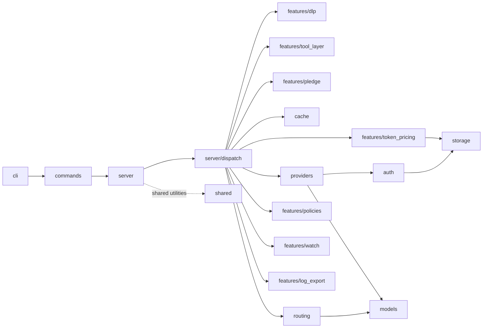

# Slice Manifest

> Vertical-slice map of the codebase. Each slice has its own `README.md`
> (slice charter) describing purpose, public API, owned files, dependencies,
> non-goals, tests, and related ADRs. This manifest is the index — when in
> doubt about where a concept lives, start here, then jump to the charter.

## Top-level slices (`src/*`)

| Slice | LOC | Files | Charter | Purpose |
|-------|-----|-------|---------|---------|
| [`auth`](../../src/auth/README.md) | 2.9k | 8 | ✓ | OAuth (PKCE), token store, virtual API keys, JWT validation |
| [`cache`](../../src/cache/README.md) | 935 | 3 | ✓ | Response cache: in-memory LRU + on-disk JSONL replay |
| [`cli`](../../src/cli/README.md) | 2.1k | 15 | ✓ | TOML config structs, clap derive, env var overrides |
| [`commands`](../../src/commands/README.md) | 7.9k | 48 | ✓ | CLI command implementations (start, stop, exec, doctor, …) |
| [`control`](../../src/control/README.md) | 684 | 2 | ✓ | Control-plane primitives shared across surfaces |
| [`models`](../../src/models/README.md) | 1.3k | 4 | ✓ | `CanonicalRequest`, response types, route classification enums |
| [`preset`](../../src/preset/README.md) | 1.9k | 4 | ✓ | Preset management (named config bundles) |
| [`providers`](../../src/providers/README.md) | 5.3k | 19 | ✓ | Anthropic, OpenAI, Gemini, DeepSeek, Ollama provider impls |
| [`routing`](../../src/routing/README.md) | 3.9k | 11 | ✓ | Classification engine, circuit breaker, health checker |
| [`security`](../../src/security/README.md) | 3.5k | 12 | ✓ | Rate limiting, audit log, headers, scoring |
| [`server`](../../src/server/README.md) | 12.9k | 48 | ✓ | Axum server, dispatch pipeline, OpenAI/Responses compat |
| [`shared`](../../src/shared/README.md) | 1.1k | 7 | ✓ | PID, instance probing, net, OTel, ACME, message tracing |
| [`storage`](../../src/storage/README.md) | 1.5k | 6 | ✓ | Atomic files, JSONL journals, AES-256-GCM (`GrobStore`) |

## Feature slices (`src/features/*`)

| Slice | LOC | Files | Charter | Purpose |
|-------|-----|-------|---------|---------|
| [`dlp`](../../src/features/dlp/README.md) | 10.0k | 20 | ✓ | DLP engine: secret scanning, PII, prompt injection, canaries |
| [`harness`](../../src/features/harness/README.md) | 999 | 5 | ✓ | Record & replay sandwich testing (feature `harness`) |
| [`log_export`](../../src/features/log_export/README.md) | 651 | 3 | ✓ | Structured log export with age-encrypted content envelopes |
| [`mcp`](../../src/features/mcp/README.md) | 2.6k | 11 | ✓ | MCP tool matrix and JSON-RPC server |
| [`pledge`](../../src/features/pledge/README.md) | 509 | 4 | ✓ | Structural tool stripping per session profile |
| [`policies`](../../src/features/policies/README.md) | 3.8k | 15 | ✓ | Unified policy engine, HIT gateway, per-action authorization |
| [`tap`](../../src/features/tap/README.md) | 369 | 2 | ✓ | Webhook tap (request/response event emission) |
| [`token_pricing`](../../src/features/token_pricing/README.md) | 794 | 2 | ✓ | Spend tracking, monthly budgets, cost calculation |
| [`tool_layer`](../../src/features/tool_layer/README.md) | 685 | 6 | ✓ | Capability gating, tool aliasing, catalog injection |
| [`watch`](../../src/features/watch/README.md) | 717 | 3 | ✓ | Live event bus + TUI traffic inspector |

## Slice graph

## Conventions

- Each slice owns its directory; cross-slice references go through public APIs
  only (the items listed in the charter's "Public API" table).
- A slice with no `README.md` is a TODO (`⏳`) — track in the Backlog PO board
  until a charter lands. A `✓` means a charter exists and is current.
- For new slices, copy the template from any existing `README.md` (start with
  `src/shared/README.md` for cross-cutting modules or `src/features/pledge/README.md`
  for a feature) and adapt section by section.
- LOC and file counts are best-effort snapshots — refresh when the slice grows
  or shrinks by more than ~20%.
- Keep the slice graph small (≤ 15 nodes) and focused on the dispatch backbone;
  push fine-grained dependencies into each slice's "Depends on" section.
- Charter files are reference docs ([Diátaxis](https://diataxis.fr/reference/));
  rationale belongs in `docs/decisions/` (ADRs), not in a charter.
